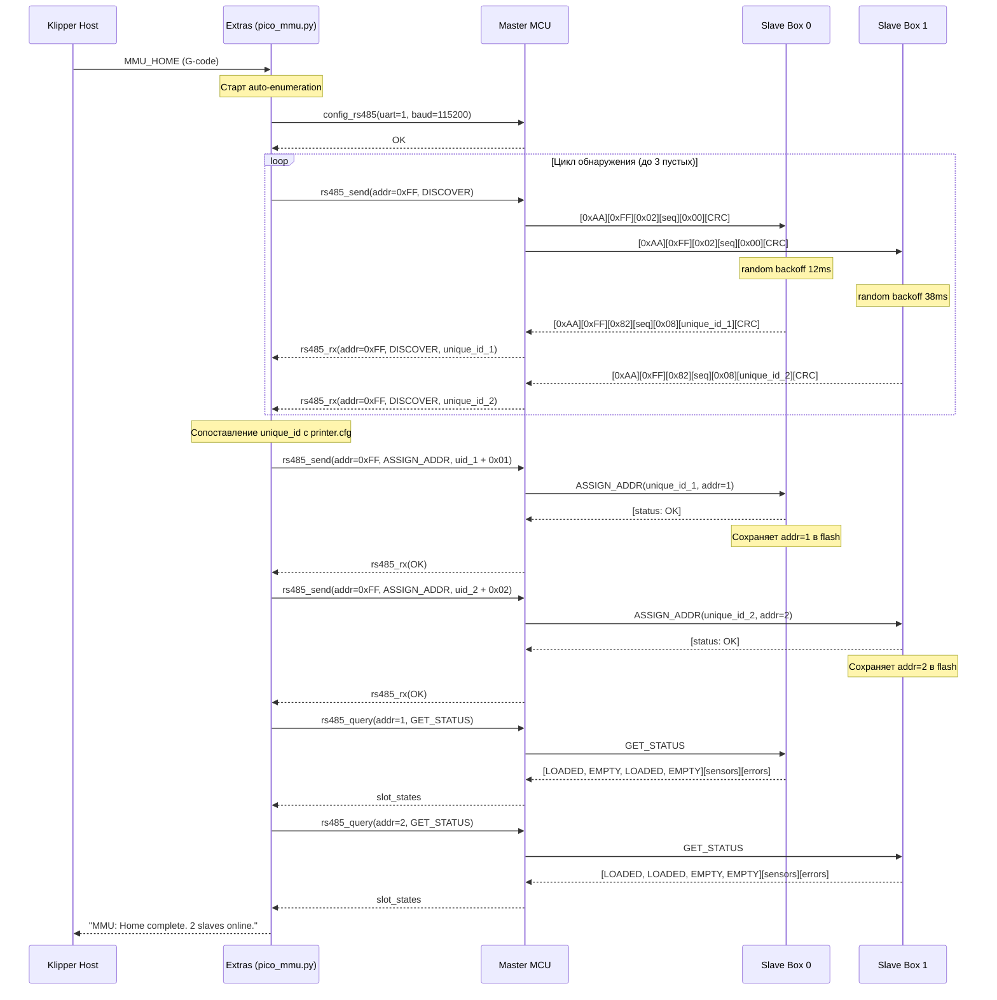
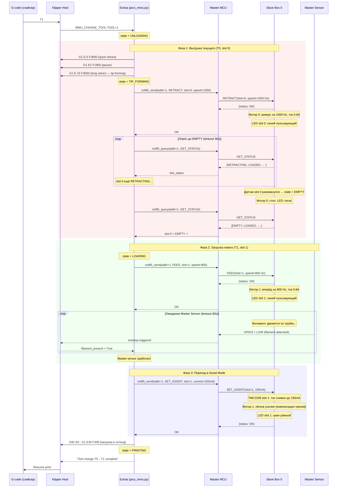
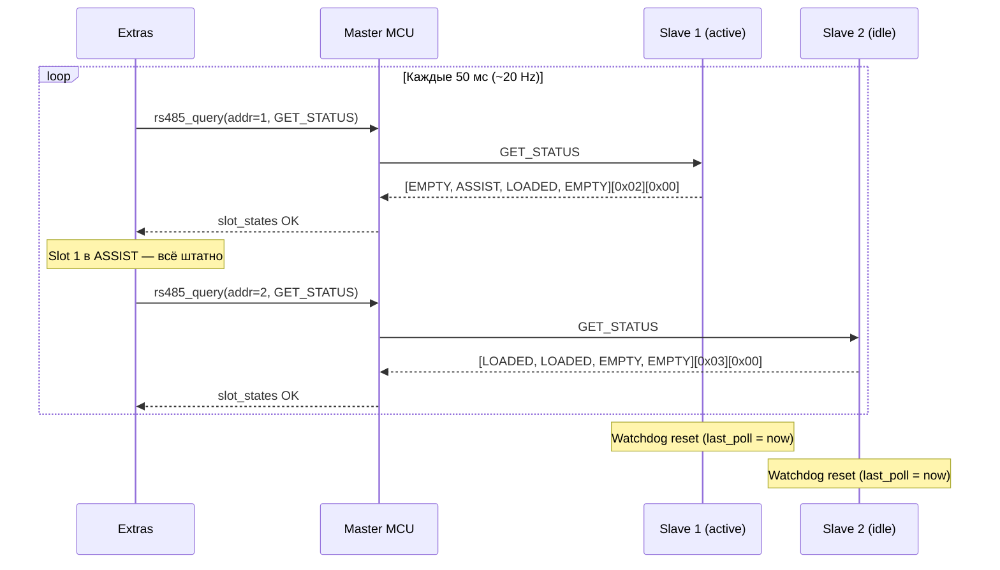
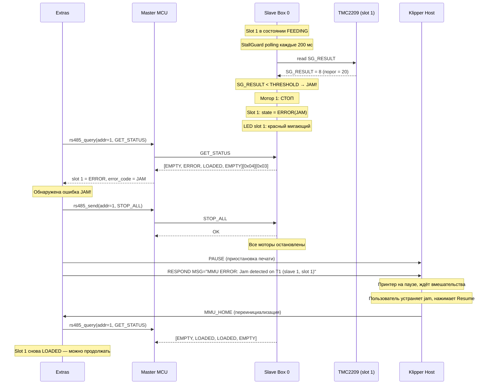
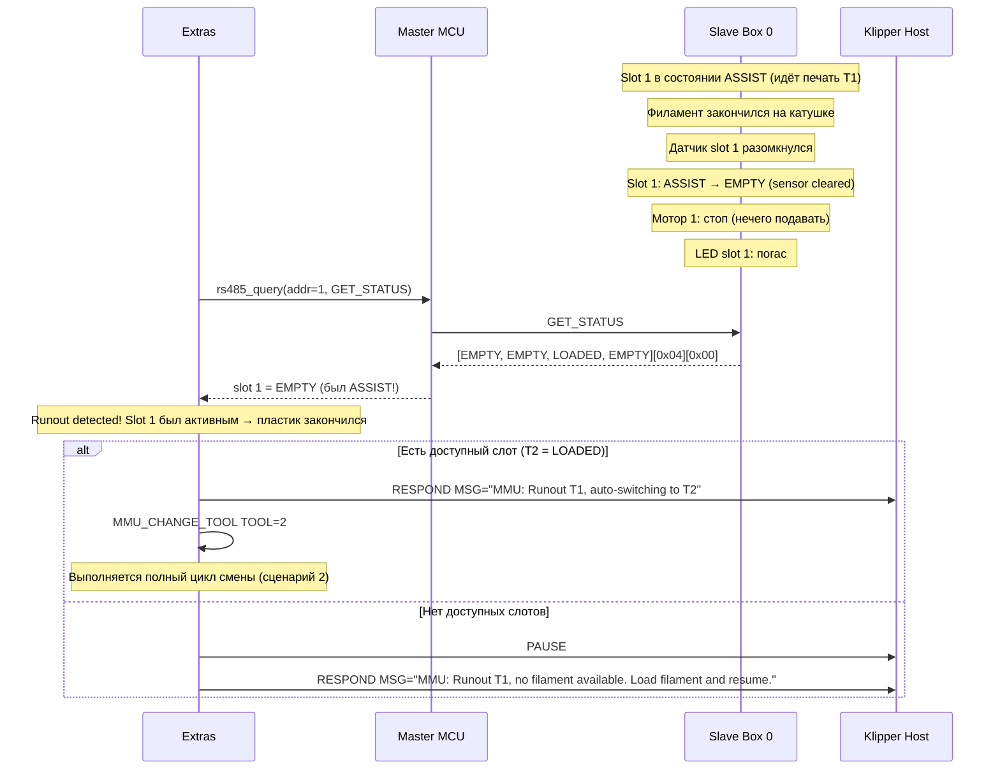
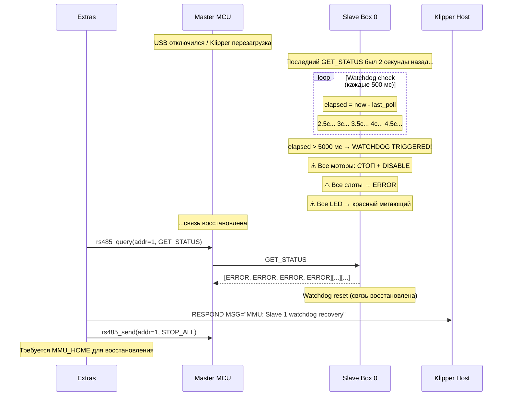
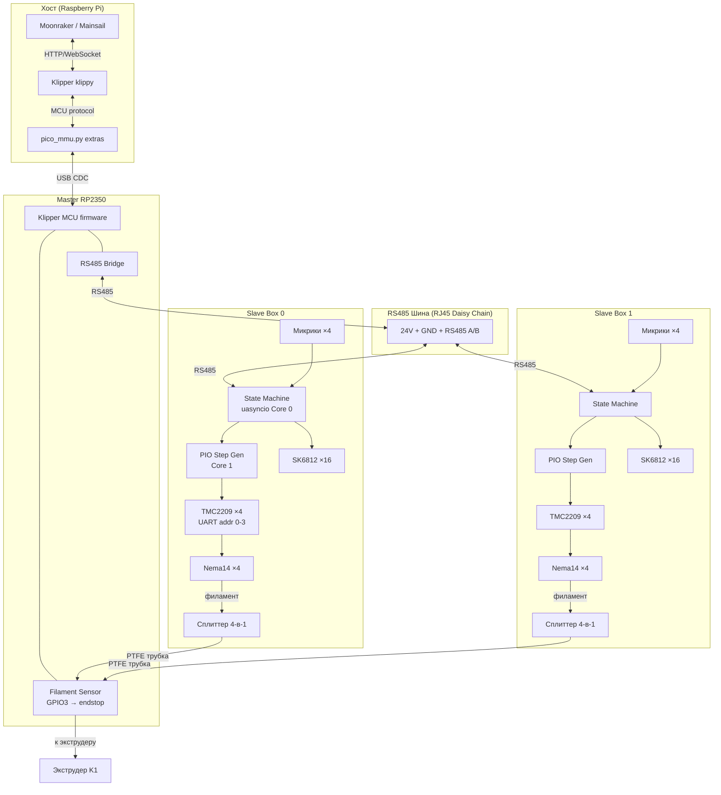

# Pico-MMU: Спецификация прошивок и протокола связи

## Архитектура

Трёхуровневая система:

| Уровень | Компонент | Язык | Расположение |
|---------|-----------|------|--------------|
| 1 | **Klipper extras module** | Python | Хост (Raspberry Pi / SBC) |
| 2 | **Master MCU firmware** | C (Klipper MCU) | RP2350 на задней стенке K1 |
| 3 | **Slave firmware** | MicroPython | RP2350 в каждом боксе |

Взаимодействие: Klipper extras ↔ Master MCU (USB CDC, Klipper protocol) ↔ Slave×N (RS485, бинарный протокол)

---

## Диаграммы взаимодействия компонентов

### Сценарий 1: Инициализация системы (MMU_HOME)



### Сценарий 2: Смена инструмента (T0 → T1)



### Сценарий 3: Штатный polling (режим печати)



### Сценарий 4: Обнаружение jam (застревание)



### Сценарий 5: Filament runout (закончился пластик)



### Сценарий 6: Потеря связи (watchdog)



### Сценарий 7: Общая блок-схема системы



---

## 1. Протокол RS485 (Master ↔ Slave)

### 1.1 Физический/канальный уровень

- Полудуплекс RS485, **115200 baud, 8N1**
- Схема: **Master Polling** — слейвы передают ТОЛЬКО в ответ на запрос мастера
- Таймаут ответа: **10 мс**, retry: до **3 раз**, после — пометить slave как OFFLINE

### 1.2 Формат кадра

```
┌──────────┬──────┬─────┬─────┬─────┬──────────────┬────────┐
│ PREAMBLE │ ADDR │ CMD │ SEQ │ LEN │     DATA     │ CRC16  │
│  1 байт  │  1   │  1  │  1  │  1  │   0–64 байт  │ 2 байта│
└──────────┴──────┴─────┴─────┴─────┴──────────────┴────────┘
```

| Поле | Размер | Описание |
|------|--------|----------|
| PREAMBLE | 1 | `0xAA` — маркер начала кадра |
| ADDR | 1 | `0x00` = broadcast, `0x01–0xFE` = адрес слейва, `0xFF` = unassigned |
| CMD | 1 | Код команды; **bit7**: `0` = request (Master→Slave), `1` = response (Slave→Master) |
| SEQ | 1 | Порядковый номер; слейв возвращает тот же SEQ в ответе |
| LEN | 1 | Длина поля DATA (0–64) |
| DATA | 0–64 | Полезная нагрузка (зависит от CMD) |
| CRC16 | 2 | CRC-16/MODBUS по всем предыдущим байтам, Little Endian |

### 1.3 Набор команд

**Направление: Master → Slave (bit7 = 0)**

| CMD | Название | DATA запрос | DATA ответ | Описание |
|-----|----------|-------------|------------|----------|
| `0x01` | PING | — | `[fw_ver:2]` | Проверка присутствия, версия прошивки |
| `0x02` | DISCOVER | — | `[unique_id:8]` | Обнаружение неназначенных (addr=0xFF) |
| `0x03` | ASSIGN_ADDR | `[unique_id:8][new_addr:1]` | `[status:1]` | Назначение адреса слейву |
| `0x04` | GET_STATUS | — | `[slot_states:4][sensors:1][errors:1]` | Состояние всех 4 слотов |
| `0x05` | FEED | `[slot:1][speed_hz:2]` | `[status:1]` | Начать подачу из слота |
| `0x06` | RETRACT | `[slot:1][speed_hz:2]` | `[status:1]` | Ретракт филамента из слота |
| `0x07` | SET_ASSIST | `[slot:1][current_ma:2]` | `[status:1]` | Включить Assist Mode |
| `0x08` | STOP | `[slot:1]` | `[status:1]` | Остановить мотор одного слота |
| `0x09` | STOP_ALL | — | `[status:1]` | Аварийная остановка всех моторов |
| `0x0A` | SET_LED | `[mode:1][slot:1][r:1][g:1][b:1]` | `[status:1]` | Управление WS2812B |
| `0x0B` | GET_CONFIG | — | `[config_blob:N]` | Чтение конфигурации слейва |
| `0x0C` | SET_CURRENT | `[slot:1][run_ma:2][hold_ma:2]` | `[status:1]` | Настройка тока TMC2209 |
| `0x0D` | HOME_SLOT | `[slot:1]` | `[status:1]` | Подача до срабатывания датчика |

**Коды статуса (поле `status` в ответе):**

| Код | Константа | Описание |
|-----|-----------|----------|
| `0x00` | OK | Команда принята/выполнена |
| `0x01` | BUSY | Слот занят другой операцией |
| `0x02` | ERROR_SLOT_EMPTY | В слоте нет филамента |
| `0x03` | ERROR_JAM | Обнаружено застревание |
| `0x04` | ERROR_TIMEOUT | Превышено время операции |
| `0x05` | ERROR_INVALID_SLOT | Номер слота вне диапазона |
| `0xFF` | UNKNOWN_CMD | Неизвестная команда |

**Состояния слота (поле `slot_states` в GET_STATUS, 1 байт × 4 слота):**

| Код | Константа | Описание |
|-----|-----------|----------|
| `0x00` | EMPTY | Нет филамента (датчик не сработал) |
| `0x01` | LOADED | Филамент присутствует, мотор стоит |
| `0x02` | FEEDING | Активная подача |
| `0x03` | RETRACTING | Ретракт |
| `0x04` | ASSIST | Режим компенсации трения (малый ток) |
| `0x05` | ERROR | Ошибка (jam / timeout) |

### 1.4 Auto-Enumeration Protocol

Выполняется при каждом старте системы (`MMU_HOME`):

```
1. Master: broadcast DISCOVER (addr=0xFF)
2. Слейвы с addr=0xFF: ответ через random backoff 0–50 мс, payload = unique_id (8 байт, RP2350 ROM ID)
3. Master: фиксирует unique_id
   - Коллизия (CRC fail или два ответа) → повторить DISCOVER для этого цикла
4. Master: ASSIGN_ADDR(unique_id, new_addr) для каждого обнаруженного
5. Слейв: сохраняет адрес в flash (rp2350 flash NVS), отвечает OK
6. Повторять шаги 1–5 пока 3 последовательных цикла DISCOVER не вернут пустой результат
```

### 1.5 Polling Cycle (штатная работа)

```python
# псевдокод, ~20 Hz
while True:
    for addr in assigned_slaves:
        resp = send_recv(GET_STATUS, addr, timeout_ms=10)
        if resp is None:
            slaves[addr].offline_count += 1
            if slaves[addr].offline_count > 3:
                raise_alarm(f"Slave {addr} OFFLINE")
        else:
            slaves[addr].update(resp)
            slaves[addr].offline_count = 0
    await asyncio.sleep_ms(50)
```

---

## 2. Slave Firmware (MicroPython, RP2350)

### 2.1 Файловая структура

```
slave/
├── main.py                  # Entry point: запуск Core 0 (asyncio) и Core 1 (_thread)
├── config.py                # Пины, адрес по умолчанию, токи, таймауты
├── bus/
│   ├── protocol.py          # Encode/decode кадра, CRC16
│   └── rs485.py             # UART + DE/RE pin management
├── motor/
│   ├── tmc2209.py           # UART-драйвер TMC2209: регистры, ток, StallGuard
│   ├── stepper.py           # PIO-based step-генерация (частота, направление)
│   └── slot.py              # Стейт-машина одного слота
├── peripheral/
│   ├── sensor.py            # Микропереключатели: debounce, IRQ
│   └── led.py               # WS2812B через PIO
├── state_machine.py         # Координатор стейт-машин 4 слотов
└── pio/
    ├── step.pio             # PIO: генерация step-импульсов
    └── ws2812.pio           # PIO: протокол WS2812B
```

### 2.2 Распределение по ядрам

| Ядро | Задачи |
|------|--------|
| **Core 0** | `uasyncio` event loop: RS485 приём/разбор команд, стейт-машина слотов, sensor IRQ, watchdog таймер |
| **Core 1** | `_thread`: PIO step-программы (4 SM), TMC2209 UART конфигурация, тайминги WS2812B |

**RP2350 PIO ресурсы:** 2 блока × 4 SM = 8 SM total.
Распределение: 4 SM для step-генерации (по одному на слот), 1 SM для WS2812B, 3 SM — резерв.

### 2.3 Стейт-машина слота

```
         [sensor triggered]
EMPTY ──────────────────────→ LOADED
                                │
              [FEED cmd]        │  [RETRACT cmd]
FEEDING ←────────────────────── │ ────────────────────→ RETRACTING
   │       [master sensor OK]   │   [sensor cleared]          │
   └──────→ LOADED ←────────────┘                             ↓ EMPTY
   │                            │
   │ [timeout/jam]              │ [SET_ASSIST]
   ↓                            ↓
ERROR ←──────────────────── ASSIST ──[STOP]──→ LOADED
   │
   └──[STOP]──→ LOADED/EMPTY (в зависимости от датчика)

STOP_ALL → останавливает мотор; новое состояние = LOADED или EMPTY по датчику
```

### 2.4 Watchdog (безопасность)

Если Master не опросил слейв (`GET_STATUS` не получен) более **5 секунд** — слейв автоматически:
1. Останавливает все моторы
2. Гасит активные LED-анимации
3. Переводит все слоты в `ERROR`

Реализуется как `uasyncio.create_task` с проверкой `last_poll_time`.

### 2.5 StallGuard (jam detection)

TMC2209 читается по UART каждые 200 мс (при активном FEED/RETRACT):
- Если `SG_RESULT < SG_THRESHOLD` → слот переходит в `ERROR(JAM)`
- `SG_THRESHOLD` задаётся в `config.py`, по умолчанию `20`

---

## 3. Master MCU Firmware (C, Klipper MCU)

### 3.1 Основа

Патч к `klipper/src/` для RP2350. Собирается стандартным `make` Klipper с `menuconfig` (target: RP2350, USB CDC). Добавляется модуль `pico_mmu/`.

### 3.2 Файловая структура (добавления к klipper/src)

```
klipper/src/pico_mmu/
├── rs485.c              # UART инициализация, TX/RX буферы, DE/RE management
├── rs485.h
├── protocol.c           # CRC-16/MODBUS, frame encode/decode
├── protocol.h
└── command_bridge.c     # Регистрация Klipper MCU команд
```

### 3.3 Klipper MCU команды (регистрируются в command_bridge.c)

| Команда | Параметры | Описание |
|---------|-----------|----------|
| `config_rs485` | `bus`, `tx_pin`, `rx_pin`, `de_pin`, `baud` | Инициализация RS485 интерфейса |
| `rs485_send` | `addr`, `cmd`, `seq`, `data` | Отправить кадр слейву |
| `rs485_query` | `addr`, `cmd`, `seq`, `data`, `timeout` | Отправить и ожидать ответ |

Ответы от слейвов передаются хосту через стандартный Klipper response callback.

### 3.4 Назначение пинов Master RP2350

| Пин | Назначение |
|-----|------------|
| USB-C | Klipper host (USB CDC) |
| UART1 TX / RX | RS485 трансивер (MAX485 / SP485) |
| GPIO (DE) | RS485 Direction Enable |
| GPIO (SENSOR) | Микропереключатель финального сплиттера (endstop) |

Датчик регистрируется как стандартный endstop Klipper — доступен через `[filament_switch_sensor]` в `printer.cfg`.

---

## 4. Klipper Extras Module (Python, хост)

### 4.1 Файл

```
klipper/klippy/extras/pico_mmu.py
```

### 4.2 G-code команды

| Команда | Параметры | Описание |
|---------|-----------|----------|
| `MMU_HOME` | — | Auto-enumeration, инициализация всех слейвов |
| `MMU_STATUS` | — | Вывод состояния всех слотов |
| `MMU_CHANGE_TOOL` | `TOOL=N` | Полный цикл смены филамента |
| `MMU_LOAD` | `TOOL=N` | Загрузка без смены (если слот уже выбран) |
| `MMU_UNLOAD` | — | Ретракт текущего филамента |
| `MMU_SELECT` | `TOOL=N` | Выбрать слот без загрузки |

`T0`, `T1`, ... `TN` — стандартные Klipper tool-change команды, переадресуются в `MMU_CHANGE_TOOL`.

### 4.3 Стейт-машина верхнего уровня (extras)

```
IDLE
 │ [T0..TN / MMU_CHANGE_TOOL]
 ↓
UNLOADING ──[tip forming + RETRACT slave]──→ TIP_FORMING
 │
 ↓
SELECTING ──[FEED target slave]──→ LOADING
 │
 ↓ [master sensor triggered]
ASSIST_ACTIVE ──[RESUME extruder]──→ PRINTING
 │
 ↓ [runout / new T cmd]
UNLOADING (повтор цикла)

ERROR ←── любой шаг при timeout/jam → PAUSE print + notify
```

### 4.4 Tool Change Sequence (полный цикл)

```
1.  Klipper: MMU_CHANGE_TOOL TOOL=N
2.  extras: сохранить текущую позицию, PAUSE extruder feed
3.  extras: выполнить tip-forming sequence (retract + wipe через Klipper extruder)
4.  extras → Master: rs485_send(current_slave, RETRACT, current_slot, speed)
5.  extras: опрашивать GET_STATUS пока slot_state[current_slot] == EMPTY (или timeout 30s → ERROR)
6.  extras → Master: rs485_send(target_slave, FEED, target_slot, speed)
7.  extras: ждать master filament sensor triggered (endstop event, timeout 60s → ERROR)
8.  extras → Master: rs485_send(target_slave, SET_ASSIST, target_slot, current_ma=150)
9.  extras: RESUME extruder feed
10. При ошибке на любом шаге: PAUSE print + RESPOND MSG с описанием ошибки
```

### 4.5 Runout Detection

Два источника runout:
1. **Активный** — Klipper G-code `T0..TN` (смена по слайсеру)
2. **Пассивный** — слейв обнаруживает пустой слот (`EMPTY`) при следующем `GET_STATUS` → extras автоматически вызывает `MMU_CHANGE_TOOL` на следующий доступный слот, или `PAUSE` если доступных нет

### 4.6 Конфигурация (printer.cfg)

```ini
[pico_mmu]
serial: /dev/serial/by-id/usb-Klipper_rp2350_XXXXX
rs485_baud: 115200
tool_count: 8
polling_interval: 50   # мс, ~20 Hz

[pico_mmu_slave box_0]
unique_id: 0x0123456789ABCDEF
slots: 0,1,2,3

[pico_mmu_slave box_1]
unique_id: 0xFEDCBA9876543210
slots: 4,5,6,7

# Стандартные T-команды
[gcode_macro T0]
gcode: MMU_CHANGE_TOOL TOOL=0

[gcode_macro T1]
gcode: MMU_CHANGE_TOOL TOOL=1
# ... и т.д.
```

---

## 5. Auto-Enumeration & Addressing

### 5.1 Startup Sequence

```
1. Master MCU boot → инициализирует RS485 (config_rs485)
2. Klipper connect → extras module загружается
3. extras: вызывает MMU_HOME (автоматически или по команде)
4. extras → Master: broadcast DISCOVER (addr=0xFF, повторить несколько циклов)
5. Master: принимает ответы с unique_id, передаёт хосту через rs485_response
6. extras: сопоставляет unique_id с [pico_mmu_slave] в printer.cfg → получает целевой адрес
7. extras → Master: ASSIGN_ADDR(unique_id, assigned_addr) для каждого найденного
8. extras: GET_STATUS для каждого назначенного → строит карту слотов
9. extras: логирует итог в Klipper console
```

### 5.2 Хранение адреса на Slave

- Адрес хранится в flash (последний сектор, 4 КБ, через `rp2_flash` MicroPython API)
- При первом запуске (flash чист) — адрес = `0xFF` (unassigned)
- После `ASSIGN_ADDR` — адрес сохраняется и переживает перезагрузку

---

## 6. Структура репозитория

```
klipper_ams/
├── spec.md                  # Аппаратная спецификация
├── FIRMWARE_SPEC.md         # Этот файл
├── master/                  # Патч к klipper/src (C)
│   └── pico_mmu/
│       ├── rs485.c / rs485.h
│       ├── protocol.c / protocol.h
│       └── command_bridge.c
├── slave/                   # Slave firmware (MicroPython)
│   ├── main.py
│   ├── config.py
│   ├── bus/
│   ├── motor/
│   ├── peripheral/
│   ├── state_machine.py
│   └── pio/
├── extras/                  # Klipper extras module
│   └── pico_mmu.py
└── tests/                   # Тесты
    ├── test_protocol.py     # Unit: frame encode/decode, CRC16
    ├── test_state_machine.py # Unit: переходы стейт-машины (mock hardware)
    └── test_enumeration.py  # Integration: auto-enumeration
```

---

## 7. Верификация

| Тест | Тип | Критерий успеха |
|------|-----|-----------------|
| Frame encode/decode + CRC16 | Unit (Python) | Все тест-векторы совпадают на обоих концах |
| Slave state machine | Unit (mock hardware) | Все переходы EMPTY→LOADED→...→ERROR→LOADED корректны |
| RS485 loopback | Hardware (2× Pico 2) | Все команды (0x01–0x0D) получены без ошибок, latency < 10 мс |
| Auto-enumeration | Hardware (3 slave) | Все слейвы обнаружены и получили адрес за 1 цикл MMU_HOME |
| Full tool change T0→T1 | Integration (Klipper) | Смена за < 10 с, без ошибок, assist mode активен |
| Stress polling | Hardware (8 slave, 1 час) | Нет потерь пакетов > 0.1%, нет зависаний |

---

## 8. Принятые решения

| Решение | Обоснование |
|---------|-------------|
| Master на C (Klipper MCU firmware) | Нативная интеграция с Klipper, стандартный filament sensor, нет latency overhead |
| Slave на MicroPython | Быстрая итерация, PIO для real-time задач, достаточная производительность |
| Auto-enumeration по RP2350 unique_id | Без DIP-переключателей, адрес хранится в flash |
| Polling 20 Hz | Баланс отзывчивости (50 мс) и нагрузки на шину |
| Tip forming на стороне Klipper | Полный контроль над экструдером, переиспользование существующей логики |
| StallGuard для jam detection | Без дополнительных датчиков, TMC2209 встроенная возможность |
| Watchdog 5 с на slave | Безопасная остановка при потере связи |

## 9. Вне текущего скоупа (будущие фазы)

- OTA обновление прошивки слейвов по RS485
- Web UI / Mainsail интеграция
- Moonraker plugin
- Поддержка Nema 17 с другими токами (конфиг уже предусмотрен)
- Цветовая маркировка катушек (LED preset по типу пластика)
