# Firmware and Protocol Specification

## Architecture

Three-tier system:

| Layer | Component | Language | Location |
|---|---|---|---|
| 1 | **Klipper extras module** | Python | Host (Raspberry Pi / SBC) |
| 2 | **Master MCU firmware** | C (Klipper MCU) | RP2350 on the printer back panel |
| 3 | **Slave firmware** | MicroPython | RP2350 in each slave box |

Interaction: Klipper extras ↔ Master MCU (USB CDC, Klipper protocol) ↔ Slave×N (RS485, binary protocol)

---

## Sequence Diagrams

Scenarios are grouped by concern:

- **Setup & Bus Management** — Scenarios 1–2
- **Core Print Operations** — Scenarios 3–7
- **Filament Metadata** — Scenarios 8–12
- **Fault Handling** — Scenarios 13–15
- **Infinite Spool & Runout Recovery** — Scenarios 16–17
- **Architecture Reference** — Scenario 18 (no test)

---

### Scenario 1: System Initialisation (MMU_HOME)

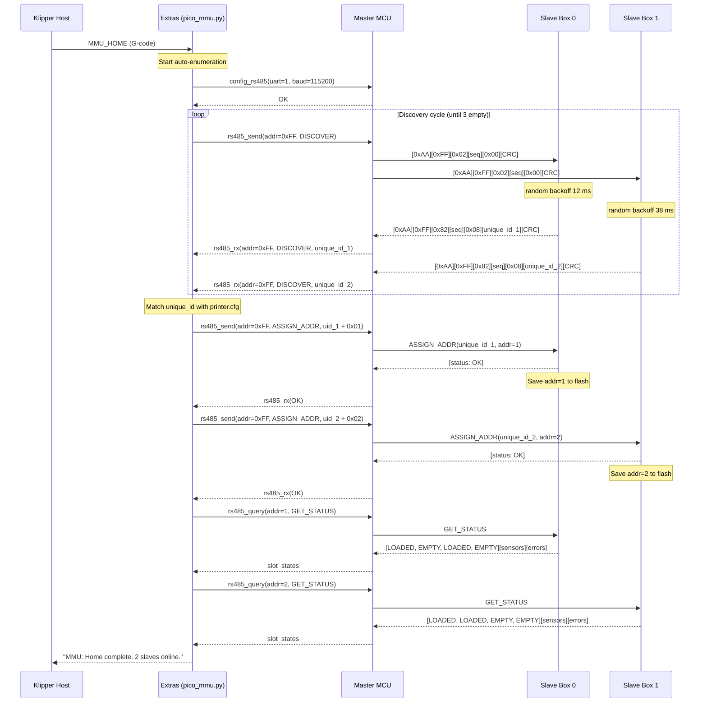
```mermaid
sequenceDiagram
    participant K as Klipper Host
    participant E as Extras (pico_mmu.py)
    participant M as Master MCU
    participant S1 as Slave Box 0
    participant S2 as Slave Box 1

    K->>E: MMU_HOME (G-code)
    Note over E: Start auto-enumeration

    E->>M: config_rs485(uart=1, baud=115200)
    M-->>E: OK

    loop Discovery cycle (until 3 empty)
        E->>M: rs485_send(addr=0xFF, DISCOVER)
        M->>S1: [0xAA][0xFF][0x02][seq][0x00][CRC]
        M->>S2: [0xAA][0xFF][0x02][seq][0x00][CRC]
        Note over S1: random backoff 12 ms
        Note over S2: random backoff 38 ms
        S1-->>M: [0xAA][0xFF][0x82][seq][0x08][unique_id_1][CRC]
        M-->>E: rs485_rx(addr=0xFF, DISCOVER, unique_id_1)
        S2-->>M: [0xAA][0xFF][0x82][seq][0x08][unique_id_2][CRC]
        M-->>E: rs485_rx(addr=0xFF, DISCOVER, unique_id_2)
    end

    Note over E: Match unique_id with printer.cfg

    E->>M: rs485_send(addr=0xFF, ASSIGN_ADDR, uid_1 + 0x01)
    M->>S1: ASSIGN_ADDR(unique_id_1, addr=1)
    S1-->>M: [status: OK]
    Note over S1: Save addr=1 to flash
    M-->>E: rs485_rx(OK)

    E->>M: rs485_send(addr=0xFF, ASSIGN_ADDR, uid_2 + 0x02)
    M->>S2: ASSIGN_ADDR(unique_id_2, addr=2)
    S2-->>M: [status: OK]
    Note over S2: Save addr=2 to flash
    M-->>E: rs485_rx(OK)

    E->>M: rs485_query(addr=1, GET_STATUS)
    M->>S1: GET_STATUS
    S1-->>M: [LOADED, EMPTY, LOADED, EMPTY][sensors][errors]
    M-->>E: slot_states

    E->>M: rs485_query(addr=2, GET_STATUS)
    M->>S2: GET_STATUS
    S2-->>M: [LOADED, LOADED, EMPTY, EMPTY][sensors][errors]
    M-->>E: slot_states

    E-->>K: "MMU: Home complete. 2 slaves online."
```

### Scenario 2: Hot-Plug — Second Slave Joins Active Bus

**Context:** The system is running normally with Slave 1 assigned and being polled at 20 Hz. A second slave box is powered on mid-session and needs to join the bus without interrupting ongoing operations.

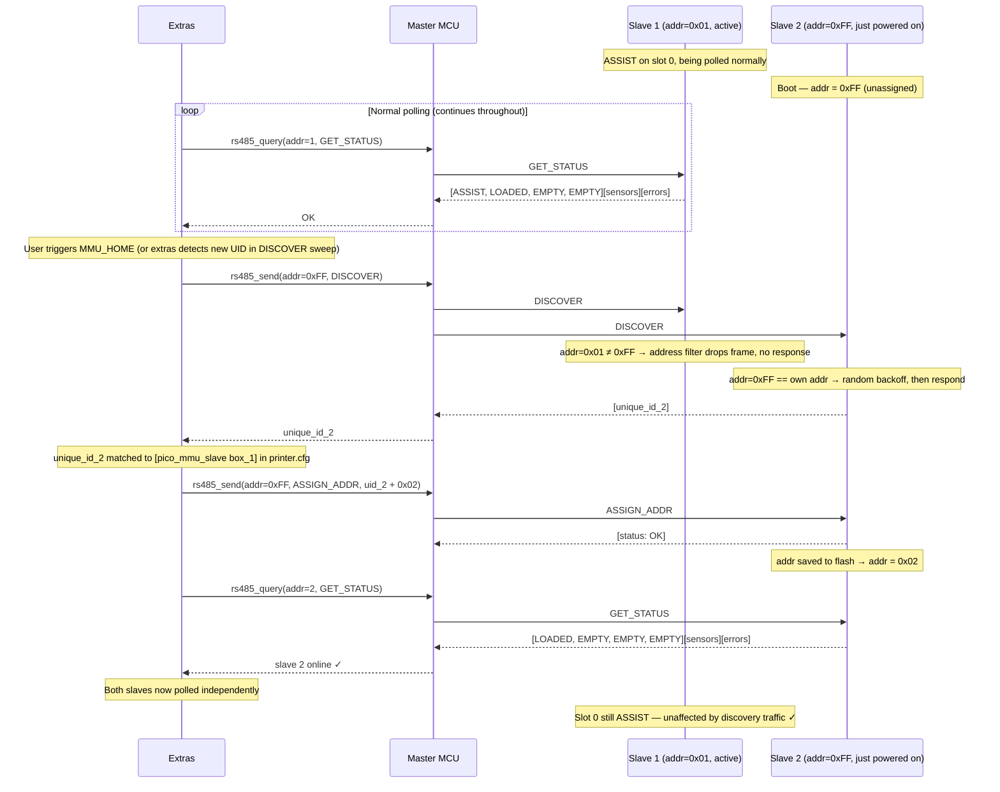
```mermaid
sequenceDiagram
    participant E as Extras
    participant M as Master MCU
    participant S1 as Slave 1 (addr=0x01, active)
    participant S2 as Slave 2 (addr=0xFF, just powered on)

    Note over S1: ASSIST on slot 0, being polled normally
    Note over S2: Boot — addr = 0xFF (unassigned)

    loop Normal polling (continues throughout)
        E->>M: rs485_query(addr=1, GET_STATUS)
        M->>S1: GET_STATUS
        S1-->>M: [ASSIST, LOADED, EMPTY, EMPTY][sensors][errors]
        M-->>E: OK
    end

    Note over E: User triggers MMU_HOME (or extras detects new UID in DISCOVER sweep)

    E->>M: rs485_send(addr=0xFF, DISCOVER)
    M->>S1: DISCOVER
    M->>S2: DISCOVER
    Note over S1: addr=0x01 ≠ 0xFF → address filter drops frame, no response
    Note over S2: addr=0xFF == own addr → random backoff, then respond
    S2-->>M: [unique_id_2]
    M-->>E: unique_id_2

    Note over E: unique_id_2 matched to [pico_mmu_slave box_1] in printer.cfg

    E->>M: rs485_send(addr=0xFF, ASSIGN_ADDR, uid_2 + 0x02)
    M->>S2: ASSIGN_ADDR
    S2-->>M: [status: OK]
    Note over S2: addr saved to flash → addr = 0x02

    E->>M: rs485_query(addr=2, GET_STATUS)
    M->>S2: GET_STATUS
    S2-->>M: [LOADED, EMPTY, EMPTY, EMPTY][sensors][errors]
    M-->>E: slave 2 online ✓

    Note over E: Both slaves now polled independently
    Note over S1: Slot 0 still ASSIST — unaffected by discovery traffic ✓
```

**Key invariant:** An already-assigned slave ignores `DISCOVER` because its address filter rejects `addr=0xFF` frames (it only processes frames addressed to its own address, broadcast `0x00`, or `DISCOVER`/`ASSIGN_ADDR` when `addr == 0xFF`).

---

### Scenario 3: Normal Polling (during print)

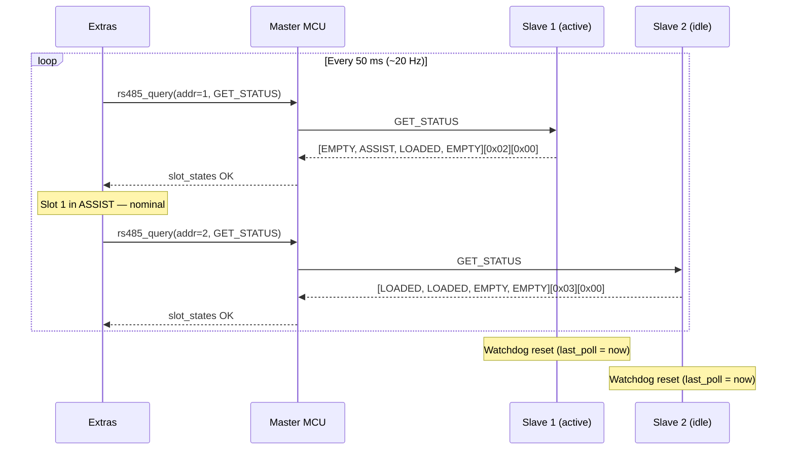
```mermaid
sequenceDiagram
    participant E as Extras
    participant M as Master MCU
    participant S1 as Slave 1 (active)
    participant S2 as Slave 2 (idle)

    loop Every 50 ms (~20 Hz)
        E->>M: rs485_query(addr=1, GET_STATUS)
        M->>S1: GET_STATUS
        S1-->>M: [EMPTY, ASSIST, LOADED, EMPTY][0x02][0x00]
        M-->>E: slot_states OK
        Note over E: Slot 1 in ASSIST — nominal

        E->>M: rs485_query(addr=2, GET_STATUS)
        M->>S2: GET_STATUS
        S2-->>M: [LOADED, LOADED, EMPTY, EMPTY][0x03][0x00]
        M-->>E: slot_states OK
    end

    Note over S1: Watchdog reset (last_poll = now)
    Note over S2: Watchdog reset (last_poll = now)
```

### Scenario 4: Tool Change (T0 → T1)

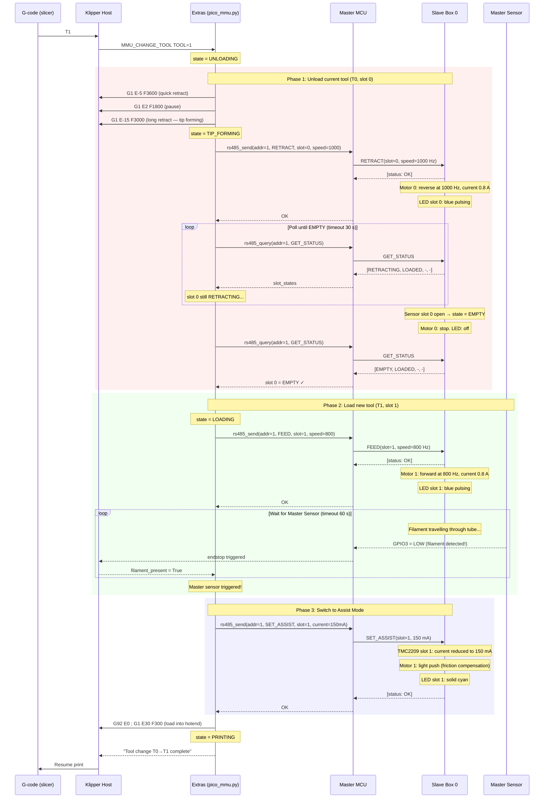
```mermaid
sequenceDiagram
    participant Slicer as G-code (slicer)
    participant K as Klipper Host
    participant E as Extras (pico_mmu.py)
    participant M as Master MCU
    participant S as Slave Box 0
    participant Sensor as Master Sensor

    Slicer->>K: T1
    K->>E: MMU_CHANGE_TOOL TOOL=1
    Note over E: state = UNLOADING

    rect rgb(255, 240, 240)
        Note over E,S: Phase 1: Unload current tool (T0, slot 0)
        E->>K: G1 E-5 F3600 (quick retract)
        E->>K: G1 E2 F1800 (pause)
        E->>K: G1 E-15 F3000 (long retract — tip forming)
        Note over E: state = TIP_FORMING

        E->>M: rs485_send(addr=1, RETRACT, slot=0, speed=1000)
        M->>S: RETRACT(slot=0, speed=1000 Hz)
        S-->>M: [status: OK]
        Note over S: Motor 0: reverse at 1000 Hz, current 0.8 A
        Note over S: LED slot 0: blue pulsing
        M-->>E: OK

        loop Poll until EMPTY (timeout 30 s)
            E->>M: rs485_query(addr=1, GET_STATUS)
            M->>S: GET_STATUS
            S-->>M: [RETRACTING, LOADED, -, -]
            M-->>E: slot_states
            Note over E: slot 0 still RETRACTING...
        end

        Note over S: Sensor slot 0 open → state = EMPTY
        Note over S: Motor 0: stop. LED: off
        E->>M: rs485_query(addr=1, GET_STATUS)
        M->>S: GET_STATUS
        S-->>M: [EMPTY, LOADED, -, -]
        M-->>E: slot 0 = EMPTY ✓
    end

    rect rgb(240, 255, 240)
        Note over E,Sensor: Phase 2: Load new tool (T1, slot 1)
        Note over E: state = LOADING

        E->>M: rs485_send(addr=1, FEED, slot=1, speed=800)
        M->>S: FEED(slot=1, speed=800 Hz)
        S-->>M: [status: OK]
        Note over S: Motor 1: forward at 800 Hz, current 0.8 A
        Note over S: LED slot 1: blue pulsing
        M-->>E: OK

        loop Wait for Master Sensor (timeout 60 s)
            Note over S: Filament travelling through tube...
            Sensor-->>M: GPIO3 = LOW (filament detected!)
            M-->>K: endstop triggered
            K-->>E: filament_present = True
        end

        Note over E: Master sensor triggered!
    end

    rect rgb(240, 240, 255)
        Note over E,S: Phase 3: Switch to Assist Mode
        E->>M: rs485_send(addr=1, SET_ASSIST, slot=1, current=150mA)
        M->>S: SET_ASSIST(slot=1, 150 mA)
        Note over S: TMC2209 slot 1: current reduced to 150 mA
        Note over S: Motor 1: light push (friction compensation)
        Note over S: LED slot 1: solid cyan
        S-->>M: [status: OK]
        M-->>E: OK
    end

    E->>K: G92 E0 #59; G1 E30 F300 (load into hotend)
    Note over E: state = PRINTING
    E-->>K: "Tool change T0→T1 complete"
    K->>Slicer: Resume print
```

### Scenario 5: Short Retracts During Active Print (ASSIST Unaffected)

**Context:** Print is in progress with slot 0 in ASSIST mode. The slicer emits small retraction moves between travel segments (typically 0.5–2 mm) to prevent oozing. These are extruder-only moves — the slave is never notified and stays in ASSIST throughout.

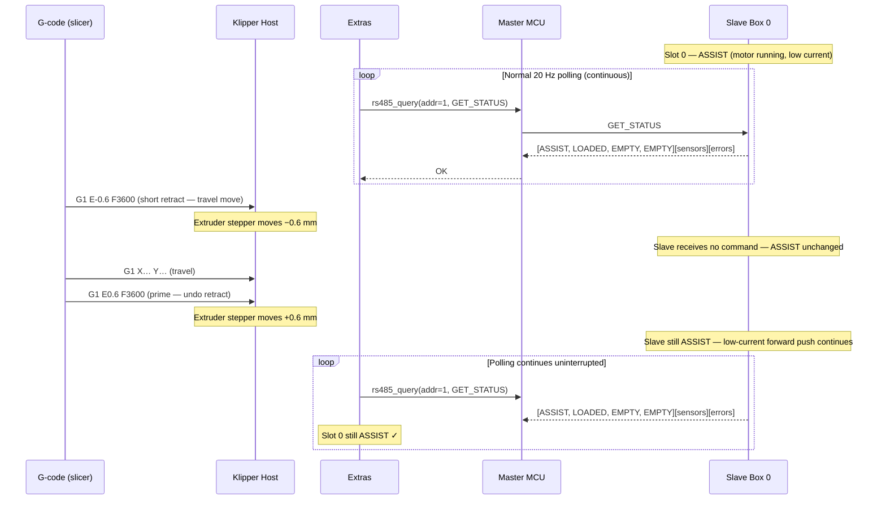
```mermaid
sequenceDiagram
    participant Slicer as G-code (slicer)
    participant K as Klipper Host
    participant E as Extras
    participant M as Master MCU
    participant S as Slave Box 0

    Note over S: Slot 0 — ASSIST (motor running, low current)

    loop Normal 20 Hz polling (continuous)
        E->>M: rs485_query(addr=1, GET_STATUS)
        M->>S: GET_STATUS
        S-->>M: [ASSIST, LOADED, EMPTY, EMPTY][sensors][errors]
        M-->>E: OK
    end

    Slicer->>K: G1 E-0.6 F3600  (short retract — travel move)
    Note over K: Extruder stepper moves −0.6 mm
    Note over S: Slave receives no command — ASSIST unchanged

    Slicer->>K: G1 X… Y… (travel)
    Slicer->>K: G1 E0.6 F3600   (prime — undo retract)
    Note over K: Extruder stepper moves +0.6 mm
    Note over S: Slave still ASSIST — low-current forward push continues

    loop Polling continues uninterrupted
        E->>M: rs485_query(addr=1, GET_STATUS)
        S-->>M: [ASSIST, LOADED, EMPTY, EMPTY][sensors][errors]
        Note over E: Slot 0 still ASSIST ✓
    end
```

**Key invariant:** Short extruder retracts are purely Klipper extruder moves. The slave motor runs independently at constant low current in ASSIST; there is no RS485 command for a short retract. The slave is not aware of extruder position.

### Scenario 6: Concurrent Slots — ASSIST Active While Another Slot Is Fed

**Context:** Slot 0 is in ASSIST mode (the active tool is printing). The master simultaneously stages the next colour by feeding slot 1. Both motors run independently; each slot's state machine is fully isolated.

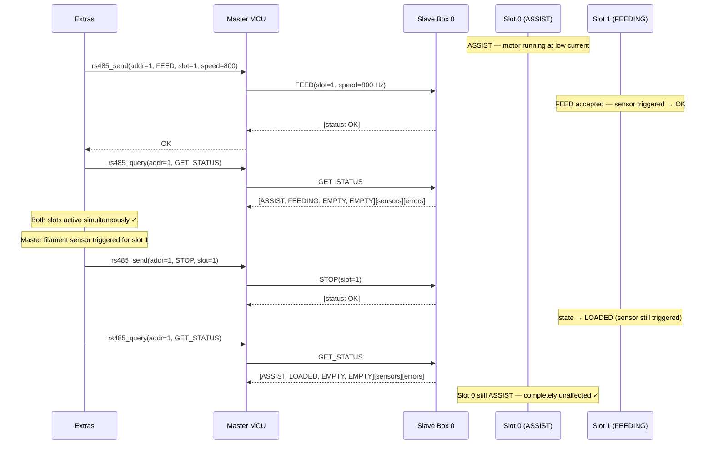
```mermaid
sequenceDiagram
    participant E as Extras
    participant M as Master MCU
    participant S as Slave Box 0
    participant Slot0 as Slot 0 (ASSIST)
    participant Slot1 as Slot 1 (FEEDING)

    Note over Slot0: ASSIST — motor running at low current

    E->>M: rs485_send(addr=1, FEED, slot=1, speed=800)
    M->>S: FEED(slot=1, speed=800 Hz)
    Note over Slot1: FEED accepted — sensor triggered → OK
    S-->>M: [status: OK]
    M-->>E: OK

    E->>M: rs485_query(addr=1, GET_STATUS)
    M->>S: GET_STATUS
    S-->>M: [ASSIST, FEEDING, EMPTY, EMPTY][sensors][errors]
    Note over E: Both slots active simultaneously ✓

    Note over E: Master filament sensor triggered for slot 1
    E->>M: rs485_send(addr=1, STOP, slot=1)
    M->>S: STOP(slot=1)
    S-->>M: [status: OK]
    Note over Slot1: state → LOADED (sensor still triggered)

    E->>M: rs485_query(addr=1, GET_STATUS)
    M->>S: GET_STATUS
    S-->>M: [ASSIST, LOADED, EMPTY, EMPTY][sensors][errors]
    Note over Slot0: Slot 0 still ASSIST — completely unaffected ✓
```

**Key invariant:** Each slot has its own stepper, TMC2209, and state machine instance. Commands to different slots are fully independent; there is no shared lock between them.

### Scenario 7: RETRACT on an Idle Slot While Another Is in ASSIST

**Context:** Print is in progress (slot 1 in ASSIST). The operator or slicer triggers an unload of slot 2, which is currently LOADED (e.g. staging the next spool change or removing unused filament). Both operations run on the same slave concurrently.

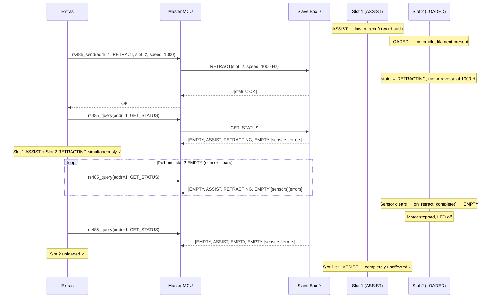
```mermaid
sequenceDiagram
    participant E as Extras
    participant M as Master MCU
    participant S as Slave Box 0
    participant Slot1 as Slot 1 (ASSIST)
    participant Slot2 as Slot 2 (LOADED)

    Note over Slot1: ASSIST — low-current forward push
    Note over Slot2: LOADED — motor idle, filament present

    E->>M: rs485_send(addr=1, RETRACT, slot=2, speed=1000)
    M->>S: RETRACT(slot=2, speed=1000 Hz)
    Note over Slot2: state → RETRACTING, motor reverse at 1000 Hz
    S-->>M: [status: OK]
    M-->>E: OK

    E->>M: rs485_query(addr=1, GET_STATUS)
    M->>S: GET_STATUS
    S-->>M: [EMPTY, ASSIST, RETRACTING, EMPTY][sensors][errors]
    Note over E: Slot 1 ASSIST + Slot 2 RETRACTING simultaneously ✓

    loop Poll until slot 2 EMPTY (sensor clears)
        E->>M: rs485_query(addr=1, GET_STATUS)
        S-->>M: [EMPTY, ASSIST, RETRACTING, EMPTY][sensors][errors]
    end

    Note over Slot2: Sensor clears → on_retract_complete() → EMPTY
    Note over Slot2: Motor stopped, LED off

    E->>M: rs485_query(addr=1, GET_STATUS)
    S-->>M: [EMPTY, ASSIST, EMPTY, EMPTY][sensors][errors]
    Note over E: Slot 2 unloaded ✓
    Note over Slot1: Slot 1 still ASSIST — completely unaffected ✓
```

**Key invariant:** `RETRACT` on a LOADED slot is accepted regardless of what other slots are doing. The `retract()` method only checks the state of its own slot (`Slot` instance). If the slot is in ASSIST, `retract()` stops the assist motor first and then starts reverse — but here slot 2 is LOADED (idle), so it proceeds directly to RETRACTING.

### Scenario 8: Set Filament Info

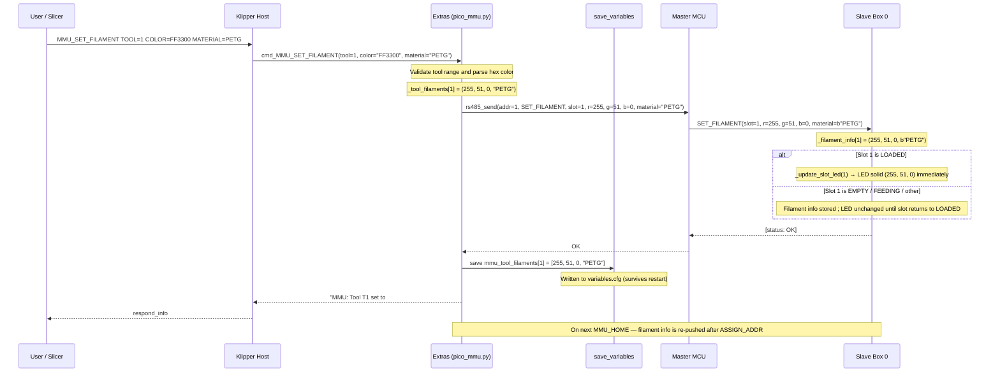
```mermaid
sequenceDiagram
    participant U as User / Slicer
    participant K as Klipper Host
    participant E as Extras (pico_mmu.py)
    participant SV as save_variables
    participant M as Master MCU
    participant S as Slave Box 0

    U->>K: MMU_SET_FILAMENT TOOL=1 COLOR=FF3300 MATERIAL=PETG
    K->>E: cmd_MMU_SET_FILAMENT(tool=1, color="FF3300", material="PETG")

    Note over E: Validate tool range and parse hex color
    Note over E: _tool_filaments[1] = (255, 51, 0, "PETG")

    E->>M: rs485_send(addr=1, SET_FILAMENT, slot=1, r=255, g=51, b=0, material="PETG")
    M->>S: SET_FILAMENT(slot=1, r=255, g=51, b=0, material=b"PETG")
    Note over S: _filament_info[1] = (255, 51, 0, b"PETG")
    alt Slot 1 is LOADED
        Note over S: _update_slot_led(1) → LED solid (255, 51, 0) immediately
    else Slot 1 is EMPTY / FEEDING / other
        Note over S: Filament info stored #59; LED unchanged until slot returns to LOADED
    end
    S-->>M: [status: OK]
    M-->>E: OK

    E->>SV: save mmu_tool_filaments[1] = [255, 51, 0, "PETG"]
    Note over SV: Written to variables.cfg (survives restart)

    E-->>K: "MMU: Tool T1 set to #FF3300 material=PETG"
    K-->>U: respond_info

    Note over E,S: On next MMU_HOME — filament info is re-pushed after ASSIGN_ADDR
```

### Scenario 9: Filament Info After Power Cycle

**Context:** A previous session set filament info for some slots via `MMU_SET_FILAMENT`. The printer was then powered off. On the next boot the user runs `MMU_HOME` — no `MMU_SET_FILAMENT` commands are issued in this session.

**Key design fact:** The slave does **not** persist `_filament_info` to flash. On every boot it resets to the compiled-in default (solid green, unknown material). The slave also does **not** report filament info in `GET_STATUS` — only slot states, sensor bits, and error codes are returned. Klipper (`save_variables` → `variables.cfg`) is the sole persistent store for filament assignments; the slave is always a downstream consumer.

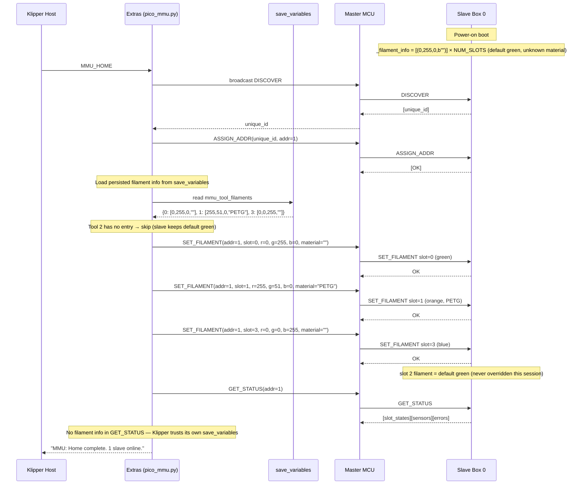
```mermaid
sequenceDiagram
    participant K as Klipper Host
    participant E as Extras (pico_mmu.py)
    participant SV as save_variables
    participant M as Master MCU
    participant S as Slave Box 0

    Note over S: Power-on boot
    Note over S: _filament_info = [(0,255,0,b"")] × NUM_SLOTS  (default green, unknown material)

    K->>E: MMU_HOME
    E->>M: broadcast DISCOVER
    M->>S: DISCOVER
    S-->>M: [unique_id]
    M-->>E: unique_id

    E->>M: ASSIGN_ADDR(unique_id, addr=1)
    M->>S: ASSIGN_ADDR
    S-->>M: [OK]

    Note over E: Load persisted filament info from save_variables
    E->>SV: read mmu_tool_filaments
    SV-->>E: {0: [0,255,0,""], 1: [255,51,0,"PETG"], 3: [0,0,255,""]}
    Note over E: Tool 2 has no entry → skip (slave keeps default green)

    E->>M: SET_FILAMENT(addr=1, slot=0, r=0, g=255, b=0, material="")
    M->>S: SET_FILAMENT slot=0 (green)
    S-->>M: OK

    E->>M: SET_FILAMENT(addr=1, slot=1, r=255, g=51, b=0, material="PETG")
    M->>S: SET_FILAMENT slot=1 (orange, PETG)
    S-->>M: OK

    E->>M: SET_FILAMENT(addr=1, slot=3, r=0, g=0, b=255, material="")
    M->>S: SET_FILAMENT slot=3 (blue)
    S-->>M: OK

    Note over S: slot 2 filament = default green (never overridden this session)

    E->>M: GET_STATUS(addr=1)
    M->>S: GET_STATUS
    S-->>M: [slot_states][sensors][errors]
    Note over E: No filament info in GET_STATUS — Klipper trusts its own save_variables

    E-->>K: "MMU: Home complete. 1 slave online."
```

**Summary of responsibilities:**

| Concern | Owner |
|---|---|
| Filament info persistence across power cycles | Klipper `save_variables` (`variables.cfg`) |
| Filament info storage during a session | Slave RAM (`_filament_info[]`) |
| Filament info reporting to host | Not implemented — slave never pushes filament info; host is the source of truth |
| Re-synchronisation on boot | `MMU_HOME` → `ASSIGN_ADDR` phase pushes all saved colors back to the slave |
| Slots with no saved color | Slave default green `(0, 255, 0)` is used; Klipper shows no color entry |

### Scenario 10: SET_FILAMENT While a Slot Is in ASSIST (branch A/B)

**Context:** During active printing (slot in ASSIST), the user updates the filament info for the active slot and/or for an idle slot.

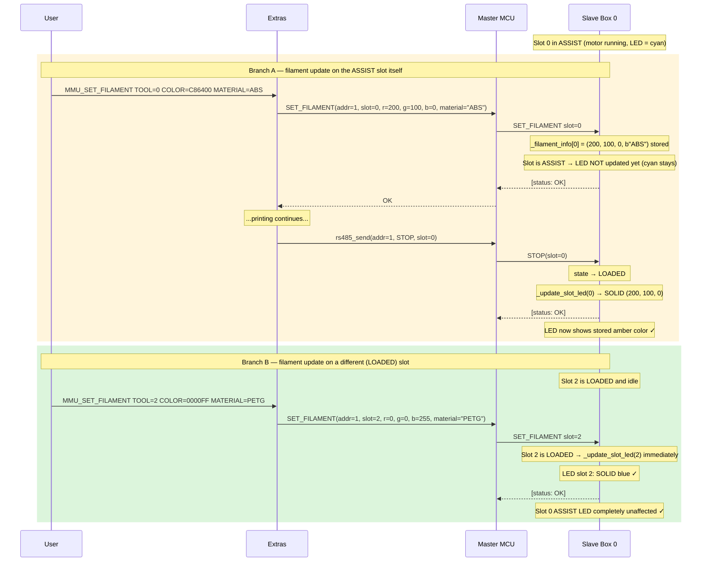
```mermaid
sequenceDiagram
    participant U as User
    participant E as Extras
    participant M as Master MCU
    participant S as Slave Box 0

    Note over S: Slot 0 in ASSIST (motor running, LED = cyan)

    rect rgb(255, 245, 220)
        Note over U,S: Branch A — filament update on the ASSIST slot itself
        U->>E: MMU_SET_FILAMENT TOOL=0 COLOR=C86400 MATERIAL=ABS
        E->>M: SET_FILAMENT(addr=1, slot=0, r=200, g=100, b=0, material="ABS")
        M->>S: SET_FILAMENT slot=0
        Note over S: _filament_info[0] = (200, 100, 0, b"ABS") stored
        Note over S: Slot is ASSIST → LED NOT updated yet (cyan stays)
        S-->>M: [status: OK]
        M-->>E: OK

        Note over E: ...printing continues...

        E->>M: rs485_send(addr=1, STOP, slot=0)
        M->>S: STOP(slot=0)
        Note over S: state → LOADED
        Note over S: _update_slot_led(0) → SOLID (200, 100, 0)
        S-->>M: [status: OK]
        Note over S: LED now shows stored amber color ✓
    end

    rect rgb(220, 245, 220)
        Note over U,S: Branch B — filament update on a different (LOADED) slot
        Note over S: Slot 2 is LOADED and idle
        U->>E: MMU_SET_FILAMENT TOOL=2 COLOR=0000FF MATERIAL=PETG
        E->>M: SET_FILAMENT(addr=1, slot=2, r=0, g=0, b=255, material="PETG")
        M->>S: SET_FILAMENT slot=2
        Note over S: Slot 2 is LOADED → _update_slot_led(2) immediately
        Note over S: LED slot 2: SOLID blue ✓
        S-->>M: [status: OK]
        Note over S: Slot 0 ASSIST LED completely unaffected ✓
    end
```

**Key rules:**
- `SET_FILAMENT` always stores the filament info in `_filament_info[slot]`.
- `_update_slot_led` is only called if `slot.state == LOADED`; all other states (ASSIST, FEEDING, RETRACTING, ERROR, EMPTY) leave the LED unchanged.
- The stored color is automatically applied on the next `LOADED` transition (e.g., after `STOP`).
- Material is stored on the slave for LED identity purposes; infinite-spool auto-grouping on the Klipper side uses `(color, material)` as the group key.

### Scenario 11: Filament Info Preserved After Runout

**Context:** A slot is in ASSIST (printing in progress). The spool runs out — the slave sensor clears and the slot transitions `ASSIST → EMPTY` autonomously. The slave must **not** wipe `_filament_info` on this transition. The master does not need to re-send `SET_FILAMENT` for a same-spool reload; if a new spool is inserted the LED immediately shows the stored color.

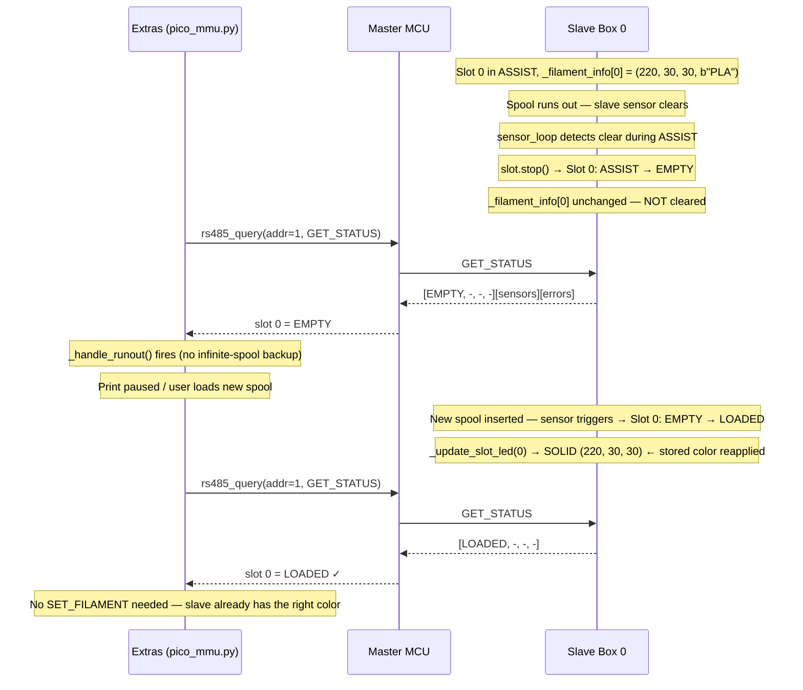
```mermaid
sequenceDiagram
    participant E as Extras (pico_mmu.py)
    participant M as Master MCU
    participant S as Slave Box 0

    Note over S: Slot 0 in ASSIST, _filament_info[0] = (220, 30, 30, b"PLA")
    Note over S: Spool runs out — slave sensor clears

    Note over S: sensor_loop detects clear during ASSIST
    Note over S: slot.stop() → Slot 0: ASSIST → EMPTY
    Note over S: _filament_info[0] unchanged — NOT cleared

    E->>M: rs485_query(addr=1, GET_STATUS)
    M->>S: GET_STATUS
    S-->>M: [EMPTY, -, -, -][sensors][errors]
    M-->>E: slot 0 = EMPTY

    Note over E: _handle_runout() fires (no infinite-spool backup)
    Note over E: Print paused / user loads new spool

    Note over S: New spool inserted — sensor triggers → Slot 0: EMPTY → LOADED
    Note over S: _update_slot_led(0) → SOLID (220, 30, 30) ← stored color reapplied

    E->>M: rs485_query(addr=1, GET_STATUS)
    M->>S: GET_STATUS
    S-->>M: [LOADED, -, -, -]
    M-->>E: slot 0 = LOADED ✓
    Note over E: No SET_FILAMENT needed — slave already has the right color
```

**Key rules:**
- `_filament_info[slot]` is only written by `SET_FILAMENT` commands from the master. The slave never clears or modifies it autonomously.
- On `EMPTY → LOADED` transition (`update_from_sensor`), `_update_slot_led` uses the stored RGB automatically.
- The master must re-send `SET_FILAMENT` only when the material genuinely changes (spool swap), not on a same-material reload.

### Scenario 12: New Filament Info Applied After Planned Spool Swap

**Context:** The master deliberately retracts a slot (spool change), then pushes new `SET_FILAMENT` for the replacement material **before** the new spool is inserted. When the new spool triggers the sensor (EMPTY → LOADED), the LED and stored info immediately reflect the new material.

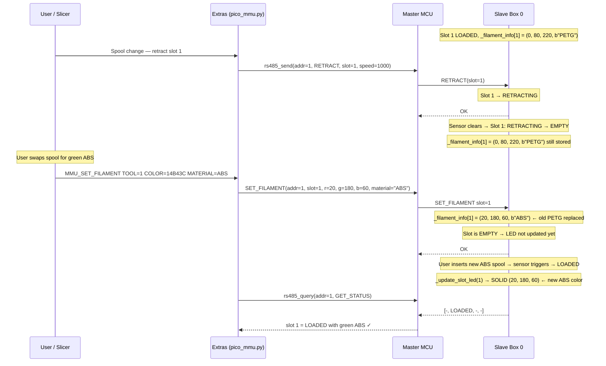
```mermaid
sequenceDiagram
    participant U as User / Slicer
    participant E as Extras (pico_mmu.py)
    participant M as Master MCU
    participant S as Slave Box 0

    Note over S: Slot 1 LOADED, _filament_info[1] = (0, 80, 220, b"PETG")

    U->>E: Spool change — retract slot 1
    E->>M: rs485_send(addr=1, RETRACT, slot=1, speed=1000)
    M->>S: RETRACT(slot=1)
    Note over S: Slot 1 → RETRACTING
    S-->>M: OK

    Note over S: Sensor clears → Slot 1: RETRACTING → EMPTY
    Note over S: _filament_info[1] = (0, 80, 220, b"PETG") still stored

    Note over U: User swaps spool for green ABS
    U->>E: MMU_SET_FILAMENT TOOL=1 COLOR=14B43C MATERIAL=ABS
    E->>M: SET_FILAMENT(addr=1, slot=1, r=20, g=180, b=60, material="ABS")
    M->>S: SET_FILAMENT slot=1
    Note over S: _filament_info[1] = (20, 180, 60, b"ABS") ← old PETG replaced
    Note over S: Slot is EMPTY → LED not updated yet
    S-->>M: OK

    Note over S: User inserts new ABS spool → sensor triggers → LOADED
    Note over S: _update_slot_led(1) → SOLID (20, 180, 60) ← new ABS color

    E->>M: rs485_query(addr=1, GET_STATUS)
    S-->>M: [-, LOADED, -, -]
    M-->>E: slot 1 = LOADED with green ABS ✓
```

**Key rules:**
- `SET_FILAMENT` is accepted regardless of slot state (EMPTY, LOADED, RETRACTING, etc.).
- `_update_slot_led` is only called when the slot is LOADED; storing new info on an EMPTY slot is valid and the LED updates on the next LOADED transition.
- The "spool swap window" — the period between RETRACT completing and the new spool being inserted — is when the master should issue `SET_FILAMENT` to update the color/material.

### Scenario 13: Jam Detection

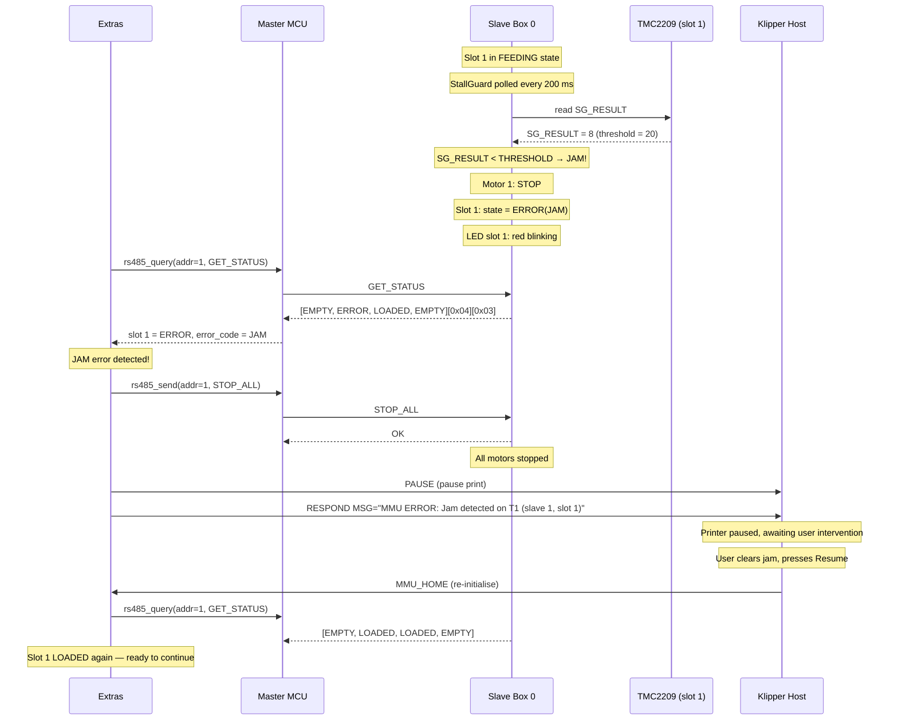
```mermaid
sequenceDiagram
    participant E as Extras
    participant M as Master MCU
    participant S as Slave Box 0
    participant TMC as TMC2209 (slot 1)
    participant K as Klipper Host

    Note over S: Slot 1 in FEEDING state
    Note over S: StallGuard polled every 200 ms

    S->>TMC: read SG_RESULT
    TMC-->>S: SG_RESULT = 8 (threshold = 20)
    Note over S: SG_RESULT < THRESHOLD → JAM!
    Note over S: Motor 1: STOP
    Note over S: Slot 1: state = ERROR(JAM)
    Note over S: LED slot 1: red blinking

    E->>M: rs485_query(addr=1, GET_STATUS)
    M->>S: GET_STATUS
    S-->>M: [EMPTY, ERROR, LOADED, EMPTY][0x04][0x03]
    M-->>E: slot 1 = ERROR, error_code = JAM

    Note over E: JAM error detected!
    E->>M: rs485_send(addr=1, STOP_ALL)
    M->>S: STOP_ALL
    S-->>M: OK
    Note over S: All motors stopped

    E->>K: PAUSE (pause print)
    E->>K: RESPOND MSG="MMU ERROR: Jam detected on T1 (slave 1, slot 1)"
    Note over K: Printer paused, awaiting user intervention

    Note over K: User clears jam, presses Resume
    K->>E: MMU_HOME (re-initialise)
    E->>M: rs485_query(addr=1, GET_STATUS)
    S-->>M: [EMPTY, LOADED, LOADED, EMPTY]
    Note over E: Slot 1 LOADED again — ready to continue
```

### Scenario 14: Filament Runout

**Design intent:** The slave spool sensor and the master splitter sensor are **NOT** runout detectors for the purpose of stopping a print. The sole authoritative runout sensor is the one located at the **printhead** (a Klipper-configured endstop/filament sensor). The slave and master sensors only reflect the presence of filament at their physical locations; their clearing does not pause or abort a print.

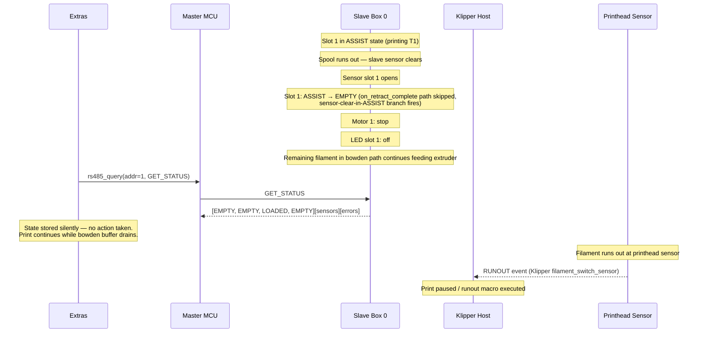
```mermaid
sequenceDiagram
    participant E as Extras
    participant M as Master MCU
    participant S as Slave Box 0
    participant K as Klipper Host
    participant PH as Printhead Sensor

    Note over S: Slot 1 in ASSIST state (printing T1)
    Note over S: Spool runs out — slave sensor clears

    Note over S: Sensor slot 1 opens
    Note over S: Slot 1: ASSIST → EMPTY (on_retract_complete path skipped,<br/>sensor-clear-in-ASSIST branch fires)
    Note over S: Motor 1: stop
    Note over S: LED slot 1: off
    Note over S: Remaining filament in bowden path continues feeding extruder

    E->>M: rs485_query(addr=1, GET_STATUS)
    M->>S: GET_STATUS
    S-->>M: [EMPTY, EMPTY, LOADED, EMPTY][sensors][errors]
    Note over E: State stored silently — no action taken.<br/>Print continues while bowden buffer drains.

    Note over PH: Filament runs out at printhead sensor
    PH-->>K: RUNOUT event (Klipper filament_switch_sensor)
    Note over K: Print paused / runout macro executed
```

**Responsibility table:**

| Sensor | Location | Clears when… | Effect on print |
|--------|----------|---------------|-----------------|
| Slave slot sensor | Spool exit | Spool empty or filament pulled back | Motor stops, LED off — **print unaffected** |
| Master splitter sensor | 4-to-1 splitter output | Filament leaves splitter | Klipper reads endstop state — **print unaffected** |
| Printhead sensor | Hotend entry | No filament at nozzle | **Print pauses** (Klipper `filament_switch_sensor` runout macro) |

### Scenario 15: Connection Loss (Watchdog)

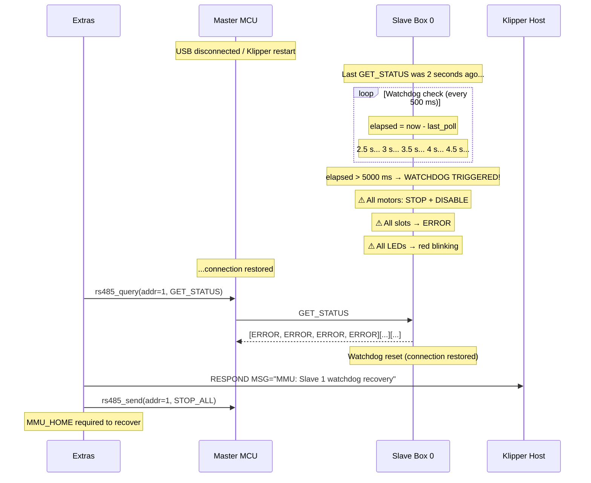
```mermaid
sequenceDiagram
    participant E as Extras
    participant M as Master MCU
    participant S as Slave Box 0
    participant K as Klipper Host

    Note over M: USB disconnected / Klipper restart
    Note over S: Last GET_STATUS was 2 seconds ago...

    loop Watchdog check (every 500 ms)
        Note over S: elapsed = now - last_poll
        Note over S: 2.5 s... 3 s... 3.5 s... 4 s... 4.5 s...
    end

    Note over S: elapsed > 5000 ms → WATCHDOG TRIGGERED!
    Note over S: ⚠ All motors: STOP + DISABLE
    Note over S: ⚠ All slots → ERROR
    Note over S: ⚠ All LEDs → red blinking

    Note over M: ...connection restored

    E->>M: rs485_query(addr=1, GET_STATUS)
    M->>S: GET_STATUS
    S-->>M: [ERROR, ERROR, ERROR, ERROR][...][...]
    Note over S: Watchdog reset (connection restored)

    E->>K: RESPOND MSG="MMU: Slave 1 watchdog recovery"
    E->>M: rs485_send(addr=1, STOP_ALL)
    Note over E: MMU_HOME required to recover
```

### Scenario 16: Infinite Spool (Slot-Chain Auto-Switch)

**Context:** Two or more slots hold the same color/material and are configured as a group.
While printing from slot 0 (ASSIST), the spool runs out — the slave sensor clears and the
slot transitions `ASSIST → EMPTY`.  The Klipper extras module detects this on the next
`GET_STATUS` poll, finds a loaded backup slot in the same group, and switches to it
automatically without user intervention.

**Configuration** (`printer.cfg`):

```ini
[pico_mmu]
serial: /dev/serial/by-id/usb-Klipper_rp2350_XXXXX
tool_count: 4
# Explicit groups: T0 and T2 share group 1 (same red PLA roll)
#                  T1 is ungrouped (0 = no auto-switch)
slot_groups: 1,0,1,0

[pico_mmu_slave box_0]
unique_id: 0x0123456789ABCDEF
slots: 0,1,2,3
colors: FF0000,00FF00,FF0000,00FF00
```

If `slot_groups` is omitted, the extras module **auto-detects groups** by comparing
filament colors: tools that share the same RGB value and number two or more are
placed in an auto-generated group.  Explicit `slot_groups` entries always take
priority over color-matching.

**Group ID rules:**

| Group ID | Meaning |
|---|---|
| `0` | Ungrouped — no auto-switch, even if color matches another slot |
| `1`…`N` | Members of the same group switch to each other on runout |

**Happy path — backup slot available:**

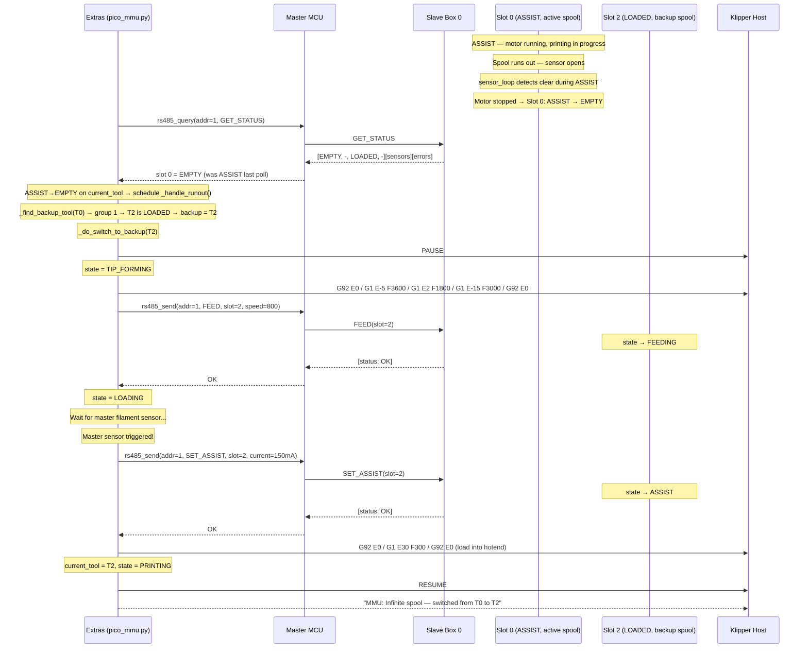
```mermaid
sequenceDiagram
    participant E as Extras (pico_mmu.py)
    participant M as Master MCU
    participant S as Slave Box 0
    participant Slot0 as Slot 0 (ASSIST, active spool)
    participant Slot2 as Slot 2 (LOADED, backup spool)
    participant K as Klipper Host

    Note over Slot0: ASSIST — motor running, printing in progress
    Note over Slot0: Spool runs out — sensor opens

    Note over Slot0: sensor_loop detects clear during ASSIST
    Note over Slot0: Motor stopped → Slot 0: ASSIST → EMPTY

    E->>M: rs485_query(addr=1, GET_STATUS)
    M->>S: GET_STATUS
    S-->>M: [EMPTY, -, LOADED, -][sensors][errors]
    M-->>E: slot 0 = EMPTY (was ASSIST last poll)

    Note over E: ASSIST→EMPTY on current_tool → schedule _handle_runout()
    Note over E: _find_backup_tool(T0) → group 1 → T2 is LOADED → backup = T2
    Note over E: _do_switch_to_backup(T2)

    E->>K: PAUSE
    Note over E: state = TIP_FORMING
    E->>K: G92 E0 / G1 E-5 F3600 / G1 E2 F1800 / G1 E-15 F3000 / G92 E0

    E->>M: rs485_send(addr=1, FEED, slot=2, speed=800)
    M->>S: FEED(slot=2)
    Note over Slot2: state → FEEDING
    S-->>M: [status: OK]
    M-->>E: OK
    Note over E: state = LOADING

    Note over E: Wait for master filament sensor...
    Note over E: Master sensor triggered!

    E->>M: rs485_send(addr=1, SET_ASSIST, slot=2, current=150mA)
    M->>S: SET_ASSIST(slot=2)
    Note over Slot2: state → ASSIST
    S-->>M: [status: OK]
    M-->>E: OK

    E->>K: G92 E0 / G1 E30 F300 / G92 E0 (load into hotend)
    Note over E: current_tool = T2, state = PRINTING
    E->>K: RESUME
    E-->>K: "MMU: Infinite spool — switched from T0 to T2"
```

**Failure path — all group members empty:**

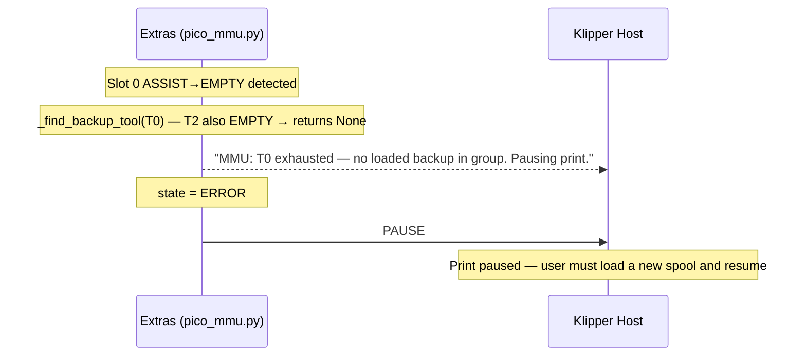
```mermaid
sequenceDiagram
    participant E as Extras (pico_mmu.py)
    participant K as Klipper Host

    Note over E: Slot 0 ASSIST→EMPTY detected
    Note over E: _find_backup_tool(T0) — T2 also EMPTY → returns None

    E-->>K: "MMU: T0 exhausted — no loaded backup in group. Pausing print."
    Note over E: state = ERROR
    E->>K: PAUSE
    Note over K: Print paused — user must load a new spool and resume
```

**Responsibility table:**

| Concern | Owner |
|---|---|
| Spool runout detection (gate sensor) | Slave firmware (`_sensor_loop`) |
| ASSIST → EMPTY transition | Slave state machine |
| Runout event detection | Klipper extras (`_poll_slaves` comparing consecutive GET_STATUS) |
| Group membership | Klipper extras (`_build_slot_groups`, `_effective_groups`) |
| Backup slot selection | Klipper extras (`_find_backup_tool`) |
| Switch execution (tip-form, load) | Klipper extras (`_do_switch_to_backup` → `_do_load`) |
| Failure handling (no backup) | Klipper extras → PAUSE + STATE_ERROR |
| Group config persistence | `printer.cfg` (`slot_groups`) or auto-color matching |

**Key invariants:**
- The RETRACT command is **not** sent during an infinite-spool switch (the slot is already
  EMPTY); only tip-forming G-code is executed before loading the backup.
- `current_tool` is updated to the new physical slot number after a successful switch.
- A `_runout_scheduled` flag prevents duplicate reactor callbacks if multiple poll
  responses arrive before the callback fires.
- If the switch itself fails (`PicoMmuError`), an emergency stop is issued and the print
  remains paused.

### Scenario 17: Spool Exhaustion Without Infinite Spool (Bowden Drain + Printhead Sensor)

**Context:** Slot 0 is in ASSIST mode (actively printing). The spool runs out — the slave
sensor clears and the slot transitions `ASSIST → EMPTY`. However, infinite spool is **not**
configured (the tool has no group or no loaded backup). The remaining filament in the
bowden tube continues to be consumed by the extruder until the printhead sensor triggers.

**Key timing:** Between the slave sensor clearing and the printhead sensor firing, there is
a "bowden drain" period (seconds to tens of seconds depending on tube length and print speed).
During this window the extruder is pulling filament with no motor assistance from the slave.

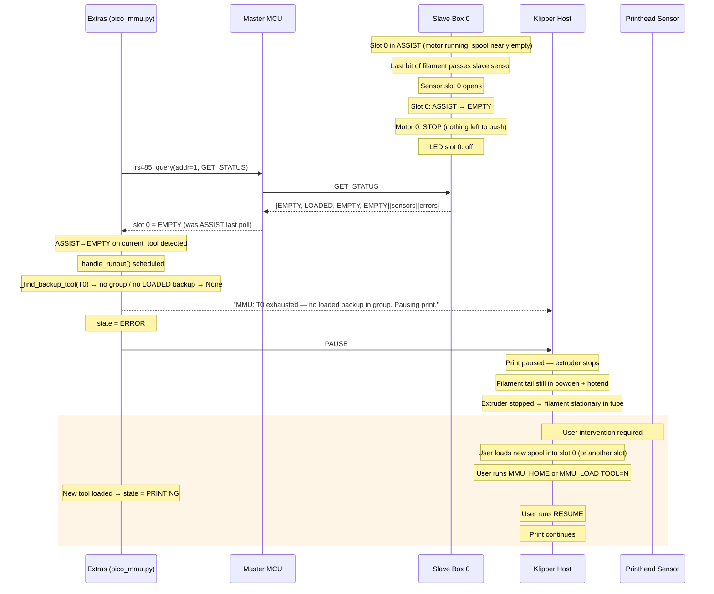
```mermaid
sequenceDiagram
    participant E as Extras (pico_mmu.py)
    participant M as Master MCU
    participant S as Slave Box 0
    participant K as Klipper Host
    participant PH as Printhead Sensor

    Note over S: Slot 0 in ASSIST (motor running, spool nearly empty)
    Note over S: Last bit of filament passes slave sensor

    Note over S: Sensor slot 0 opens
    Note over S: Slot 0: ASSIST → EMPTY
    Note over S: Motor 0: STOP (nothing left to push)
    Note over S: LED slot 0: off

    E->>M: rs485_query(addr=1, GET_STATUS)
    M->>S: GET_STATUS
    S-->>M: [EMPTY, LOADED, EMPTY, EMPTY][sensors][errors]
    M-->>E: slot 0 = EMPTY (was ASSIST last poll)

    Note over E: ASSIST→EMPTY on current_tool detected
    Note over E: _handle_runout() scheduled
    Note over E: _find_backup_tool(T0) → no group / no LOADED backup → None

    E-->>K: "MMU: T0 exhausted — no loaded backup in group. Pausing print."
    Note over E: state = ERROR
    E->>K: PAUSE
    Note over K: Print paused — extruder stops

    Note over K: Filament tail still in bowden + hotend
    Note over K: Extruder stopped → filament stationary in tube

    rect rgb(255, 245, 230)
        Note over K,PH: User intervention required
        Note over K: User loads new spool into slot 0 (or another slot)
        Note over K: User runs MMU_HOME or MMU_LOAD TOOL=N
        Note over E: New tool loaded → state = PRINTING
        Note over K: User runs RESUME
        Note over K: Print continues
    end
```

**Race condition — printhead sensor fires before extras reacts:**

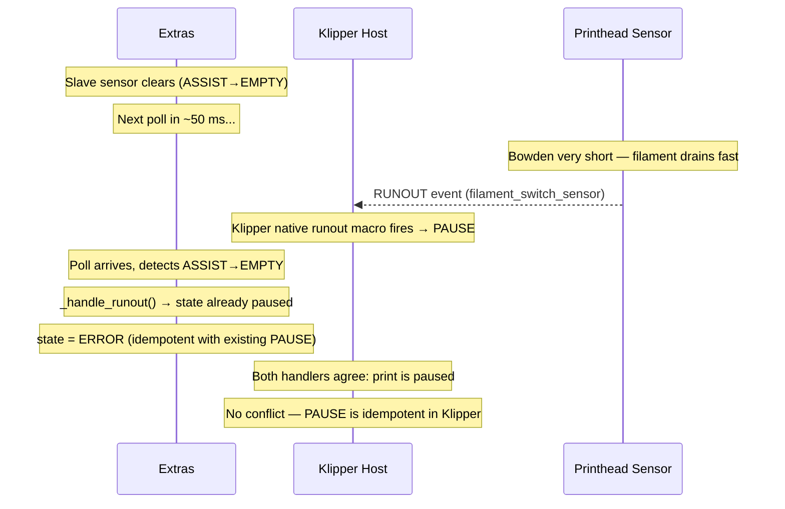
```mermaid
sequenceDiagram
    participant E as Extras
    participant K as Klipper Host
    participant PH as Printhead Sensor

    Note over E: Slave sensor clears (ASSIST→EMPTY)
    Note over E: Next poll in ~50 ms...

    Note over PH: Bowden very short — filament drains fast
    PH-->>K: RUNOUT event (filament_switch_sensor)
    Note over K: Klipper native runout macro fires → PAUSE

    Note over E: Poll arrives, detects ASSIST→EMPTY
    Note over E: _handle_runout() → state already paused
    Note over E: state = ERROR (idempotent with existing PAUSE)

    Note over K: Both handlers agree: print is paused
    Note over K: No conflict — PAUSE is idempotent in Klipper
```

**Interaction between extras runout and Klipper's `filament_switch_sensor`:**

| Event | Fires when… | Action | Priority |
|---|---|---|---|
| Extras `_handle_runout` | `GET_STATUS` poll detects ASSIST→EMPTY (~50 ms latency) | PAUSE + set STATE_ERROR | First responder (proactive) |
| Klipper `filament_switch_sensor` | Printhead sensor clears (after bowden drains) | PAUSE via runout macro | Backup safety net |
| Both fire | Short bowden or slow poll | Both call PAUSE — idempotent, no conflict | — |

**Key invariants:**
- The extras module reacts at the **slave sensor** (proactive) — it does not wait for the
  printhead sensor. This gives the user earlier warning and prevents printing into air.
- Klipper's native `filament_switch_sensor` remains active as a **safety net** — even if
  the extras module fails to react, the print will still pause when filament runs out at
  the nozzle.
- During the bowden drain period (if print is NOT paused), the extruder operates without
  ASSIST. For short bowden paths this is negligible; for very long paths (>1 m) the
  extruder may struggle with friction. This is acceptable because the pause fires within
  one poll cycle (~50 ms) of the slave sensor clearing.
- The `_handle_runout` callback and Klipper's runout macro are both idempotent with
  respect to PAUSE — calling PAUSE twice does not error or unpause.

---

### Scenario 18: System Block Diagram

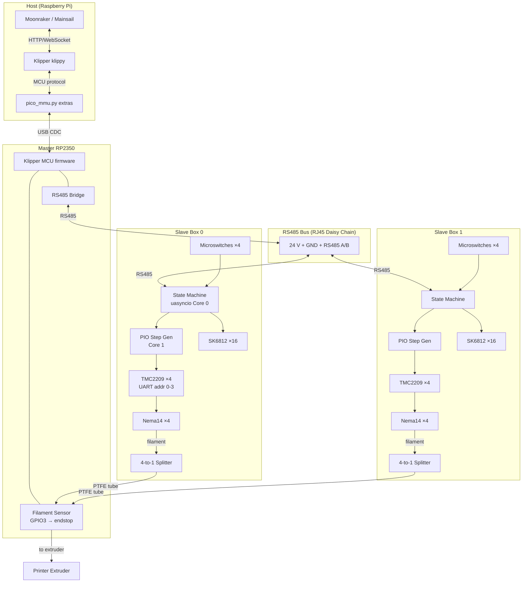
```mermaid
flowchart TB
    subgraph HOST["Host (Raspberry Pi)"]
        KL[Klipper klippy]
        EX[pico_mmu.py extras]
        MR[Moonraker / Mainsail]
    end

    subgraph MASTER["Master RP2350"]
        MCU[Klipper MCU firmware]
        RS[RS485 Bridge]
        FS[Filament Sensor<br/>GPIO3 → endstop]
    end

    subgraph BUS["RS485 Bus (RJ45 Daisy Chain)"]
        WIRE[24 V + GND + RS485 A/B]
    end

    subgraph SLAVE1["Slave Box 0"]
        SM1[State Machine<br/>uasyncio Core 0]
        PIO1[PIO Step Gen<br/>Core 1]
        TMC1[TMC2209 ×4<br/>UART addr 0-3]
        MOT1[Nema14 ×4]
        SEN1[Microswitches ×4]
        LED1[SK6812 ×16]
        SP1[4-to-1 Splitter]
    end

    subgraph SLAVE2["Slave Box 1"]
        SM2[State Machine]
        PIO2[PIO Step Gen]
        TMC2_[TMC2209 ×4]
        MOT2[Nema14 ×4]
        SEN2[Microswitches ×4]
        LED2[SK6812 ×16]
        SP2[4-to-1 Splitter]
    end

    MR <-->|HTTP/WebSocket| KL
    KL <-->|MCU protocol| EX
    EX <-->|USB CDC| MCU
    MCU --- RS
    MCU --- FS
    RS <-->|RS485| WIRE
    WIRE <-->|RS485| SM1
    WIRE <-->|RS485| SM2
    SM1 --> PIO1 --> TMC1 --> MOT1
    SM1 --> LED1
    SEN1 --> SM1
    MOT1 -->|filament| SP1

    SM2 --> PIO2 --> TMC2_ --> MOT2
    SM2 --> LED2
    SEN2 --> SM2
    MOT2 -->|filament| SP2

    SP1 -->|PTFE tube| FS
    SP2 -->|PTFE tube| FS
    FS -->|to extruder| EXT[Printer Extruder]
```

---

## 1. RS485 Protocol (Master ↔ Slave)

### 1.1 Physical / Link Layer

- Half-duplex RS485, **115200 baud, 8N1**
- Topology: **Master Polling** — slaves transmit only in response to a master request
- Response timeout: **10 ms**, retries: up to **3**, then mark slave as OFFLINE

### 1.2 Frame Format

```
┌──────────┬──────┬─────┬─────┬─────┬──────────────┬────────┐
│ PREAMBLE │ ADDR │ CMD │ SEQ │ LEN │     DATA     │ CRC16  │
│  1 byte  │  1   │  1  │  1  │  1  │  0–64 bytes  │ 2 bytes│
└──────────┴──────┴─────┴─────┴─────┴──────────────┴────────┘
```

| Field | Size | Description |
|---|---|---|
| PREAMBLE | 1 | `0xAA` — frame start marker |
| ADDR | 1 | `0x00` = broadcast, `0x01–0xFE` = slave address, `0xFF` = unassigned |
| CMD | 1 | Command code; **bit 7**: `0` = request (Master→Slave), `1` = response (Slave→Master) |
| SEQ | 1 | Sequence number; slave echoes the same SEQ in its response |
| LEN | 1 | Length of the DATA field (0–64) |
| DATA | 0–64 | Payload (command-specific) |
| CRC16 | 2 | CRC-16/MODBUS over all preceding bytes, little-endian |

### 1.3 Command Set

**Direction: Master → Slave (bit 7 = 0)**

| CMD | Name | Request DATA | Response DATA | Description |
|---|---|---|---|---|
| `0x01` | DISCOVER | — | `[unique_id:8]` | Find unassigned slaves (addr=0xFF) |
| `0x02` | ASSIGN_ADDR | `[unique_id:8][new_addr:1]` | `[status:1]` | Assign address to slave |
| `0x03` | PING | — | `[fw_ver:2]` | Presence check, returns firmware version |
| `0x04` | GET_CONFIG | — | `[config_blob:N]` | Read slave configuration |
| `0x05` | GET_STATUS | — | `[slot_states:4][sensors:1][errors:1]` | State of all 4 slots |
| `0x06` | SET_FILAMENT | `[slot:1][r:1][g:1][b:1][material:4]` | `[status:1]` | Set per-slot filament color and material; material is 4-byte NUL-padded ASCII (e.g. `PLA\0`, `PETG`); updates LED immediately if slot is LOADED |
| `0x07` | SET_CURRENT | `[slot:1][run_ma:2][hold_ma:2]` | `[status:1]` | Configure TMC2209 current |
| `0x08` | HOME_SLOT | `[slot:1]` | `[status:1]` | Feed until sensor triggers |
| `0x09` | FEED | `[slot:1][speed_hz:2]` | `[status:1]` | Start feeding from slot |
| `0x0A` | SET_ASSIST | `[slot:1][current_ma:2]` | `[status:1]` | Enable Assist Mode |
| `0x0B` | RETRACT | `[slot:1][speed_hz:2]` | `[status:1]` | Retract filament in slot |
| `0x0C` | STOP | `[slot:1]` | `[status:1]` | Stop one slot motor |
| `0x0D` | STOP_ALL | — | `[status:1]` | Emergency stop all motors |

**Status codes (`status` field in responses):**

| Code | Constant | Description |
|---|---|---|
| `0x00` | OK | Command accepted / completed |
| `0x01` | BUSY | Slot is busy with another operation |
| `0x02` | ERROR_SLOT_EMPTY | No filament in slot |
| `0x03` | ERROR_JAM | Jam detected |
| `0x04` | ERROR_TIMEOUT | Operation timed out |
| `0x05` | ERROR_INVALID_SLOT | Slot number out of range |
| `0xFF` | UNKNOWN_CMD | Unknown command |

**Slot states (`slot_states` field in GET_STATUS, 1 byte × 4 slots):**

| Code | Constant | Description |
|---|---|---|
| `0x00` | EMPTY | No filament (sensor not triggered) |
| `0x01` | LOADED | Filament present, motor idle |
| `0x02` | FEEDING | Active feed |
| `0x03` | RETRACTING | Retract in progress |
| `0x04` | ASSIST | Friction-compensation mode (low current) |
| `0x05` | ERROR | Error (jam / timeout) |

### 1.4 Auto-Enumeration Protocol

Executed on every system start (`MMU_HOME`):

```
1. Master: broadcast DISCOVER (addr=0xFF)
2. Unassigned slaves (addr=0xFF): respond after random backoff 0–50 ms,
   payload = unique_id (8 bytes, RP2350 ROM ID)
3. Master: records unique_id
   - Collision (CRC fail or two simultaneous responses) → retry DISCOVER for this cycle
4. Master: ASSIGN_ADDR(unique_id, new_addr) for each discovered slave
5. Slave: saves address to flash (rp2350 flash NVS), responds OK
6. Repeat steps 1–5 until 3 consecutive DISCOVER cycles return empty
```

### 1.5 Polling Cycle (normal operation)

```python
# pseudocode, ~20 Hz
while True:
    for addr in assigned_slaves:
        resp = send_recv(GET_STATUS, addr, timeout_ms=10)
        if resp is None:
            slaves[addr].offline_count += 1
            if slaves[addr].offline_count > 3:
                raise_alarm(f"Slave {addr} OFFLINE")
        else:
            slaves[addr].update(resp)
            slaves[addr].offline_count = 0
    await asyncio.sleep_ms(50)
```

---

## 2. Slave Firmware (MicroPython, RP2350)

### 2.1 File Structure

```
slave/
├── main.py                  # Entry point: starts Core 0 (asyncio) and Core 1 (_thread)
├── config.py                # Pins, default address, currents, timeouts
├── bus/
│   ├── protocol.py          # Frame encode/decode, CRC16
│   └── rs485.py             # UART + DE/RE pin management
├── motor/
│   ├── tmc2209.py           # TMC2209 UART driver: registers, current, StallGuard
│   ├── stepper.py           # PIO-based step generator (frequency, direction)
│   └── slot.py              # Per-slot state machine
├── peripheral/
│   ├── sensor.py            # Microswitches: debounce, IRQ
│   └── led.py               # WS2812B via PIO
└── state_machine.py         # Coordinator for 4-slot state machines
```

### 2.2 Core Assignment

| Core | Tasks |
|---|---|
| **Core 0** | `uasyncio` event loop: RS485 receive/parse, slot state machines, sensor IRQ, watchdog timer |
| **Core 1** | `_thread`: PIO step programs (4 SMs), TMC2209 UART configuration, WS2812B timing |

**RP2350 PIO resources:** 2 blocks × 4 SMs = 8 SMs total.  
Allocation: 4 SMs for step generation (one per slot), 1 SM for WS2812B, 3 SMs reserved.

### 2.3 Slot State Machine

```
         [sensor triggered]
EMPTY ──────────────────────→ LOADED
                                │
              [FEED cmd]        │  [RETRACT cmd]
FEEDING ←────────────────────── │ ────────────────────→ RETRACTING
   │       [master sensor OK]   │   [sensor cleared]          │
   └──────→ LOADED ←────────────┘                             ↓ EMPTY
   │                            │
   │ [timeout/jam]              │ [SET_ASSIST]
   ↓                            ↓
ERROR ←──────────────────── ASSIST ──[STOP]──→ LOADED
   │
   └──[STOP]──→ LOADED/EMPTY (depending on sensor)

STOP_ALL → stops motor; new state = LOADED or EMPTY based on sensor
```

### 2.4 Watchdog (safety)

If the Master has not polled the slave (`GET_STATUS` not received) for more than **5 seconds**, the slave automatically:
1. Stops all motors
2. Extinguishes active LED animations
3. Moves all slots to `ERROR`

Implemented as a `uasyncio.create_task` that checks `last_poll_time`.

### 2.5 StallGuard (jam detection)

TMC2209 is read via UART every 200 ms (while FEED or RETRACT is active):
- If `SG_RESULT < SG_THRESHOLD` → slot transitions to `ERROR(JAM)`
- `SG_THRESHOLD` is set in `config.py`, default `20`

---

## 3. Master MCU Firmware (C, Klipper MCU)

### 3.1 Overview

Patch to `klipper/src/` for RP2350. Built with the standard Klipper `make` + `menuconfig` (target: RP2350, USB CDC). Adds the `pico_mmu/` module.

### 3.2 File Structure (additions to klipper/src)

```
klipper/src/pico_mmu/
├── rs485.c              # UART init, TX/RX buffers, DE/RE management
├── rs485.h
├── protocol.c           # CRC-16/MODBUS, frame encode/decode
├── protocol.h
└── command_bridge.c     # Klipper MCU command registration
```

### 3.3 Klipper MCU Commands (registered in command_bridge.c)

| Command | Parameters | Description |
|---|---|---|
| `config_rs485` | `bus`, `tx_pin`, `rx_pin`, `de_pin`, `baud` | Initialise RS485 interface |
| `rs485_send` | `addr`, `cmd`, `seq`, `data` | Send frame to slave |
| `rs485_query` | `addr`, `cmd`, `seq`, `data`, `timeout` | Send and wait for response |

Slave responses are forwarded to the host via the standard Klipper response callback.

### 3.4 Master RP2350 Pin Assignment

| Pin | Purpose |
|---|---|
| USB-C | Klipper host (USB CDC) |
| UART1 TX / RX | RS485 transceiver (MAX485 / SP485) |
| GPIO (DE) | RS485 direction enable |
| GPIO (SENSOR) | Final splitter microswitch (endstop) |

The sensor is registered as a standard Klipper endstop — accessible via `[filament_switch_sensor]` in `printer.cfg`.

---

## 4. Klipper Extras Module (Python, host)

### 4.1 File

```
klipper/klippy/extras/pico_mmu.py
```

### 4.2 G-code Commands

| Command | Parameters | Description |
|---|---|---|
| `MMU_HOME` | — | Auto-enumeration, initialise all slaves |
| `MMU_STATUS` | — | Print state of all slots |
| `MMU_CHANGE_TOOL` | `TOOL=N` | Full filament change cycle |
| `MMU_LOAD` | `TOOL=N` | Load without changing (if slot already selected) |
| `MMU_UNLOAD` | — | Retract current filament |
| `MMU_SELECT` | `TOOL=N` | Select slot without loading |
| `MMU_SET_FILAMENT_COLOR` | `TOOL=N COLOR=RRGGBB` | Set filament color for a tool slot; pushes `SET_FILAMENT_COLOR` to the slave and persists via `[save_variables]`; colors are re-pushed to slaves on every `MMU_HOME` |

`T0`, `T1`, … `TN` — standard Klipper tool-change commands, forwarded to `MMU_CHANGE_TOOL`.

### 4.3 Top-Level State Machine (extras)

```
IDLE
 │ [T0..TN / MMU_CHANGE_TOOL]
 ↓
UNLOADING ──[tip forming + RETRACT slave]──→ TIP_FORMING
 │
 ↓
SELECTING ──[FEED target slave]──→ LOADING
 │
 ↓ [master sensor triggered]
ASSIST_ACTIVE ──[RESUME extruder]──→ PRINTING
 │
 ↓ [runout / new T cmd]
UNLOADING (cycle repeats)

ERROR ←── any step on timeout/jam → PAUSE print + notify
```

### 4.4 Tool Change Sequence (full cycle)

```
1.  Klipper: MMU_CHANGE_TOOL TOOL=N
2.  extras: save current position, PAUSE extruder feed
3.  extras: execute tip-forming sequence (retract + wipe via Klipper extruder)
4.  extras → Master: rs485_send(current_slave, RETRACT, current_slot, speed)
5.  extras: poll GET_STATUS until slot_state[current_slot] == EMPTY (or timeout 30 s → ERROR)
6.  extras → Master: rs485_send(target_slave, FEED, target_slot, speed)
7.  extras: wait for master filament sensor triggered (endstop event, timeout 60 s → ERROR)
8.  extras → Master: rs485_send(target_slave, SET_ASSIST, target_slot, current_ma=150)
9.  extras: RESUME extruder feed
10. On error at any step: PAUSE print + RESPOND MSG with error description
```

### 4.5 Runout Detection

Two runout sources:
1. **Active** — Klipper G-code `T0..TN` (slicer-driven change)
2. **Passive** — slave detects empty slot (`EMPTY`) on the next `GET_STATUS` → extras automatically calls `MMU_CHANGE_TOOL` for the next available slot, or `PAUSE` if none are available

### 4.6 Configuration (printer.cfg)

```ini
[pico_mmu]
serial: /dev/serial/by-id/usb-Klipper_rp2350_XXXXX
rs485_baud: 115200
tool_count: 8
polling_interval: 50   # ms, ~20 Hz

[pico_mmu_slave box_0]
unique_id: 0x0123456789ABCDEF
slots: 0,1,2,3

[pico_mmu_slave box_1]
unique_id: 0xFEDCBA9876543210
slots: 4,5,6,7

# Standard T-commands
[gcode_macro T0]
gcode: MMU_CHANGE_TOOL TOOL=0

[gcode_macro T1]
gcode: MMU_CHANGE_TOOL TOOL=1
# ... and so on
```

---

## 5. Auto-Enumeration & Addressing

### 5.1 Startup Sequence

```
1. Master MCU boot → initialise RS485 (config_rs485)
2. Klipper connects → extras module loads
3. extras: call MMU_HOME (automatically or on command)
4. extras → Master: broadcast DISCOVER (addr=0xFF, several cycles)
5. Master: receives responses with unique_id, forwards to host via rs485_response
6. extras: matches unique_id with [pico_mmu_slave] in printer.cfg → gets target address
7. extras → Master: ASSIGN_ADDR(unique_id, assigned_addr) for each found slave
8. extras: GET_STATUS for each assigned slave → builds slot map
9. extras: logs result to Klipper console
```

### 5.2 Address Storage on Slave

- Address stored in flash (last 4 KB sector, via `rp2_flash` MicroPython API)
- On first boot (flash empty) — address = `0xFF` (unassigned)
- After `ASSIGN_ADDR` — address is saved and survives power cycles

---

## 6. Verification

| Test | Type | Pass Criteria |
|---|---|---|
| Frame encode/decode + CRC16 | Unit (Python) | All test vectors match on both ends |
| Slave state machine | Unit (mock hardware) | All EMPTY→LOADED→…→ERROR→LOADED transitions correct |
| RS485 loopback | Hardware (2× Pico 2) | All commands (0x01–0x0D) received without errors, latency < 10 ms |
| Auto-enumeration | Hardware (3 slaves) | All slaves discovered and assigned an address in 1 MMU_HOME cycle |
| Full tool change T0→T1 | Integration (Klipper) | Change completes in < 10 s, no errors, assist mode active |
| Concurrent slots (ASSIST + FEED) | Integration (in-process, Scenario 6) | Both slot states coexist in GET_STATUS; STOP on one slot does not affect the other |
| Concurrent slots (ASSIST + RETRACT on idle slot) | Integration (in-process, Scenario 7) | RETRACT completes on idle slot; ASSIST slot state unchanged throughout |
| Short retracts during ASSIST | Design invariant (Scenario 5) | No RS485 command sent to slave for extruder-only retracts; GET_STATUS shows ASSIST throughout |
| SET_FILAMENT during ASSIST | Integration (in-process, Scenario 10) | Color stored but LED unchanged; applied on STOP → LOADED |
| SET_FILAMENT on idle slot during ASSIST | Integration (in-process, Scenario 10b) | Idle slot LED updated immediately; ASSIST slot LED unaffected |
| Filament info preserved after runout | Integration (in-process, Scenario 11) | _filament_info not cleared by ASSIST→EMPTY; reapplied on next LOADED |
| Filament info updated after spool swap | Integration (in-process, Scenario 12) | SET_FILAMENT accepted while EMPTY; new color applied on LOADED |
| Hot-plug (slave joins active bus) | Integration (in-process, Scenario 2) | Assigned slave ignores DISCOVER; new slave is enumerated and polled without disrupting the first |
| Stress polling | Hardware (8 slaves, 1 hour) | Packet loss < 0.1%, no hangs |
| Infinite spool — group resolution | Unit (`test_pico_mmu_infinite_spool.py`) | Explicit groups, auto-color, override, backup find, runout dispatch all verified |
| Infinite spool — slave switch sequence | Integration (in-process, Scenario 16) | Slave accepts FEED+STOP+ASSIST on backup slot; exhausted slot stays EMPTY |

---

## 7. Design Decisions

| Decision | Rationale |
|---|---|
| Master in C (Klipper MCU firmware) | Native Klipper integration, standard filament sensor, no latency overhead |
| Slave in MicroPython | Fast iteration, PIO for real-time tasks, adequate performance |
| Auto-enumeration via RP2350 unique_id | No DIP switches, address persisted in flash |
| 20 Hz polling | Balance between responsiveness (50 ms) and bus load |
| Tip forming on the Klipper side | Full extruder control, reuse of existing logic |
| StallGuard for jam detection | No additional sensors, built-in TMC2209 capability |
| 5 s watchdog on slave | Safe stop on connection loss |

---

## 8. Missing Features vs. Production Systems (AMS / MMU3 / CFS / ERCF)

Gap analysis comparing Osamu against Bambu AMS, Prusa MMU3, Creality CFS, and community projects (ERCF/Tradrack).

### 8.1 Reliability & Error Recovery

| Feature | Production reference | Osamu status |
|---|---|---|
| Automatic retry on failed load/unload | AMS retries 2–3× with varying speed/pressure; MMU3 similar | Not implemented — single attempt, then `PicoMmuError` |
| Filament cutter | MMU3 blade; AMS integrated cutter; CFS ships with spare cutter | No cutter — relies solely on G-code tip-forming |
| Configurable tip-forming profiles | AMS/MMU3 expose per-material tunable parameters (cooling moves, ramming) | Hardcoded G-code sequence (`E-5`/`E2`/`E-15`) — no user profile |
| Bowden length calibration | AMS measures bowden length during homing; MMU3 has calibrated load distances | Not implemented — relies on master sensor trigger timing only |
| Filament motion sensor / encoder | MMU3 encoder wheel; AMS tracks extrusion via motor current | Binary present/absent switches only — no motion sensing |
| Stuck-filament detection during unload | MMU3 encoder; AMS motor current | Only StallGuard during motor-on phases; no detection if stuck in hotend during tip-forming |

### 8.2 User Experience & UI

| Feature | Production reference | Osamu status |
|---|---|---|
| Web UI / slicer integration | AMS → Bambu Studio; MMU3 → PrusaSlicer; CFS → Creality Print | Not implemented — no Mainsail / Fluidd / Moonraker plugin |
| Material / spool database | AMS RFID tags (material, temp, weight); CFS RFID auto-identification & filament mapping | Color only — no material type, temperature profiles, or remaining weight |
| RFID / NFC spool identification | AMS reads Bambu RFID spools; CFS reads Creality Hyper RFID spools | No RFID / NFC — manual color assignment only |
| Per-material purge volumes | Slicer-integrated purge tower volumes based on material transition | No material metadata communicated to slicer |
| Remaining filament estimation | AMS tracks consumed weight via motor rotation | Binary present/gone — no usage tracking |
| Interactive error recovery | AMS/CFS guided step-by-step dialogs on touchscreen; MMU3 LCD prompts | Console text only (`RESPOND MSG=...`) |

### 8.3 Environmental & Storage

| Feature | Production reference | Osamu status |
|---|---|---|
| Moisture-proof / drybox storage | AMS sealed chamber with desiccant; CFS moisture-proof storage built-in | No enclosure or humidity management — open spool holder |
| Humidity sensor | AMS humidity sensor + indicator | No environmental sensors |
| Active filament drying | CFS/AMS companion dryer accessories; SpacePi X4 integrated drying | Not planned |

### 8.4 Operational Features

| Feature | Production reference | Osamu status |
|---|---|---|
| Filament buffer / rewinder | AMS Lite rewinder; CFS includes filament buffer; ERCF encoder + servo | No buffer management — ASSIST mode (constant low-current push) only |
| Pre-loading / staging next tool | AMS pre-stages next color during print to reduce swap time | Concurrent FEED designed (Scenario 9) but no slicer-triggered pre-staging logic in extras |
| Acceleration ramp during load/unload | AMS ramps speed to reduce jams | Constant speed only — no acceleration / deceleration ramp |
| Configurable speed per material | Different feed/retract speeds for PLA vs. TPU vs. PETG | Single global speed — no per-material or per-slot speed config |
| Snap-away / soluble support coordination | CFS supports snap-away support material via filament mapping | No support-material awareness |
| Idle / power management | Motors disabled after inactivity; CFS sleep mode | Watchdog kills motors on timeout, but no graceful idle mode during long non-MMU segments |
| OTA firmware update | AMS via Bambu Studio; MMU3 via PrusaSlicer; CFS via Creality Print | Not implemented |
| Statistics / logging | Tool change count, success rate, average swap time | Not implemented |
| Nema 17 motor support | Various community projects | Config structure accommodates it, but untested |

### 8.5 Safety & Edge Cases

| Feature | Production reference | Osamu status |
|---|---|---|
| Hotend temperature check before load | AMS/MMU3 won't load into cold hotend | No temp check — cold hotend jam risk |
| Per-slave failure isolation | CFS continues with remaining slots if one unit jams | `_emergency_stop()` halts ALL slaves on any error — no per-slave isolation |
| Power-loss recovery | AMS/CFS resume with known filament state | No persistence — `MMU_HOME` required after every restart |
| Bus error counters / diagnostics | Internal retransmission + telemetry in AMS/CFS | No error counters exposed to user |
| Filament diameter / tangle detection | Some community projects | Not planned |

### 8.6 Priority Order (highest impact first)

1. **No automatic retry** — single biggest reliability gap vs. all production systems
2. **Hardcoded tip-forming** — must be configurable per material
3. **No hotend temp check** before load — safety issue
4. **No UI / Moonraker integration** — usability blocker
5. **No bowden length calibration** — affects load detection reliability
6. **Emergency stop is all-or-nothing** — should isolate per-slave failures
7. **No filament motion sensing** — can't detect grinding or partial clogs
8. **No spool / material metadata** — color only; no purge volume, temp, or RFID
9. **No filament buffer** — ASSIST mode alone may not compensate for long bowden paths
10. **No OTA firmware update** — maintenance burden as fleet grows
