# Firmware and Protocol Specification

## Architecture

Three-tier system:

| Layer | Component | Language | Location |
|---|---|---|---|
| 1 | **Klipper extras module** | Python | Host (Raspberry Pi / SBC) |
| 2 | **Master MCU firmware** | C (Klipper MCU) | RP2350 on the printer back panel |
| 3 | **Slave firmware** | MicroPython | RP2350 in each slave box |

Interaction: Klipper extras ↔ Master MCU (USB CDC, Klipper protocol) ↔ Slave×N (RS485, binary protocol)

---

## Sequence Diagrams

### Scenario 1: System Initialisation (MMU_HOME)

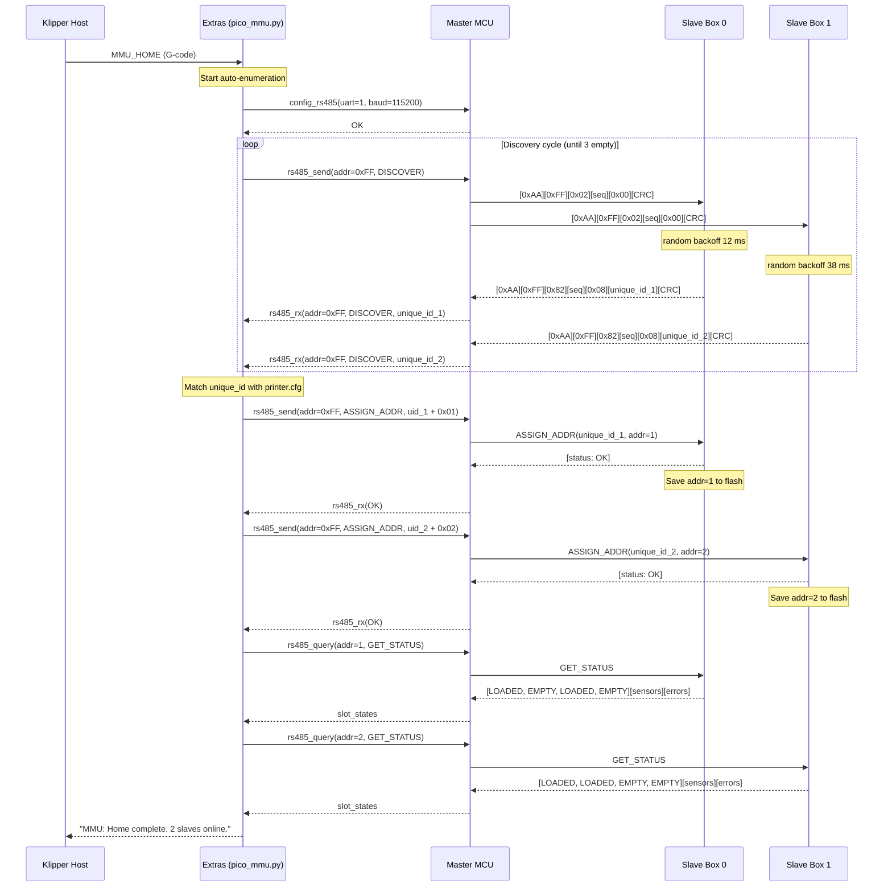

### Scenario 2: Tool Change (T0 → T1)

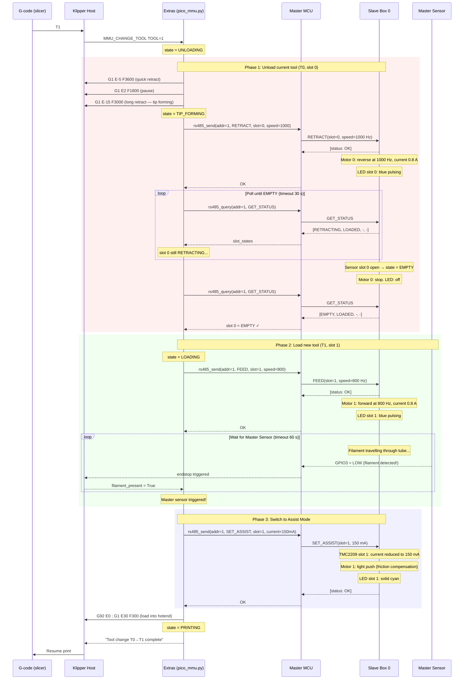

### Scenario 3: Normal Polling (during print)

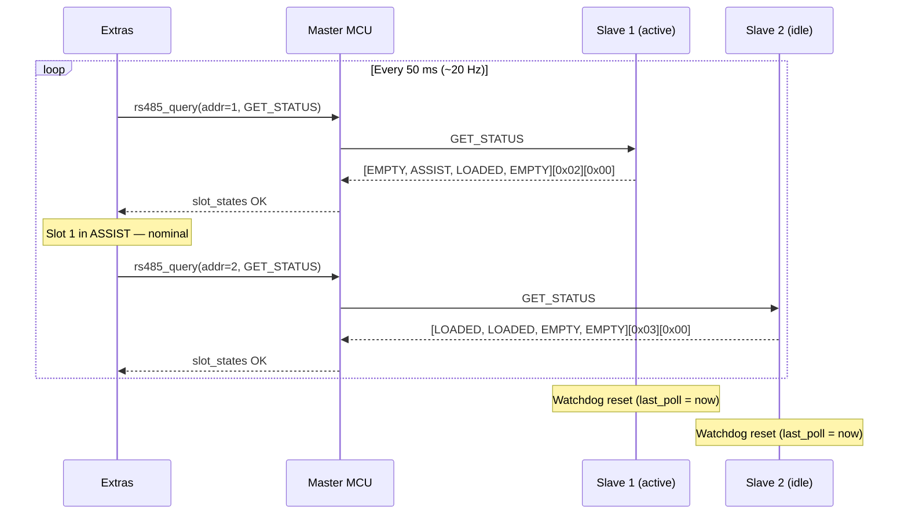

### Scenario 4: Jam Detection

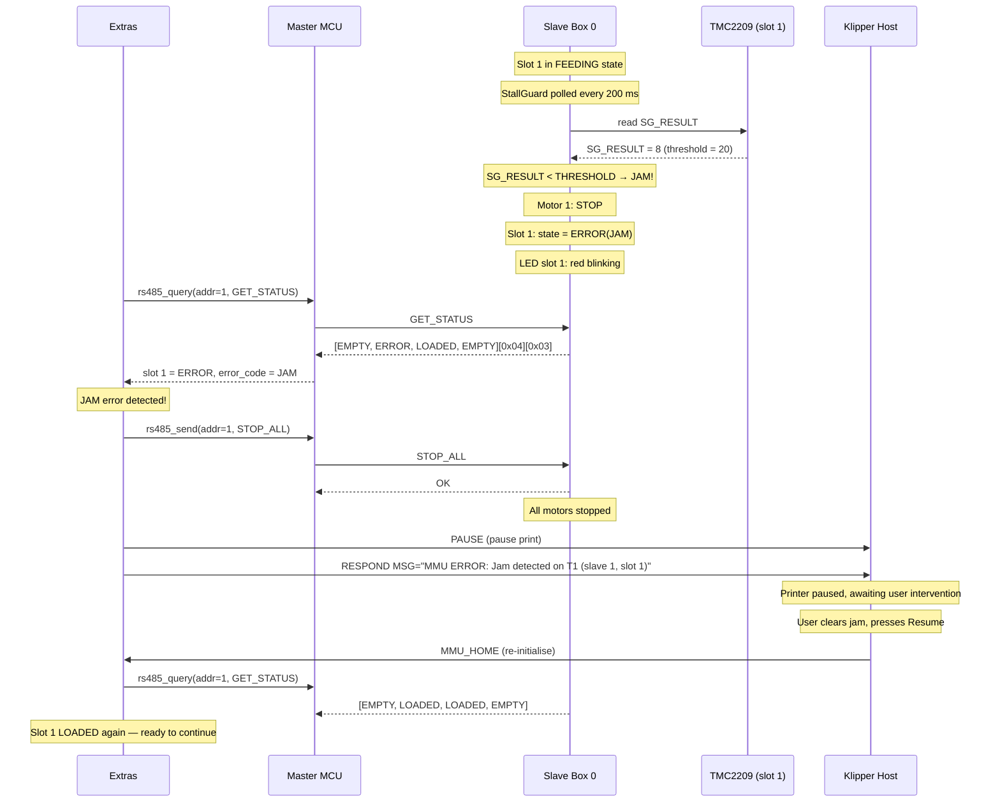

### Scenario 5: Filament Runout

**Design intent:** The slave spool sensor and the master splitter sensor are **NOT** runout detectors for the purpose of stopping a print. The sole authoritative runout sensor is the one located at the **printhead** (a Klipper-configured endstop/filament sensor). The slave and master sensors only reflect the presence of filament at their physical locations; their clearing does not pause or abort a print.

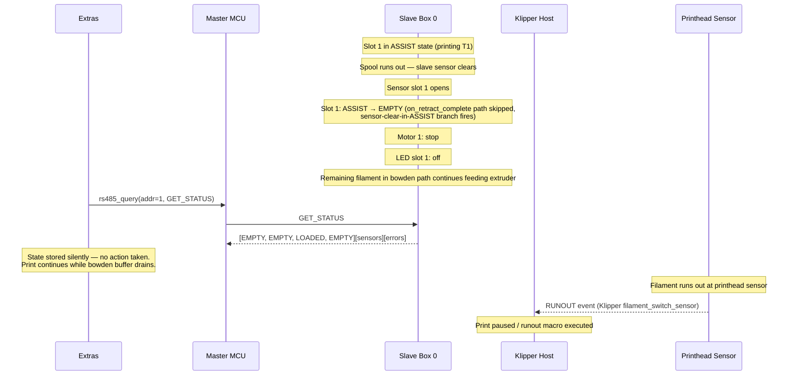

**Responsibility table:**

| Sensor | Location | Clears when… | Effect on print |
|--------|----------|---------------|-----------------|
| Slave slot sensor | Spool exit | Spool empty or filament pulled back | Motor stops, LED off — **print unaffected** |
| Master splitter sensor | 4-to-1 splitter output | Filament leaves splitter | Klipper reads endstop state — **print unaffected** |
| Printhead sensor | Hotend entry | No filament at nozzle | **Print pauses** (Klipper `filament_switch_sensor` runout macro) |

### Scenario 6: Connection Loss (Watchdog)

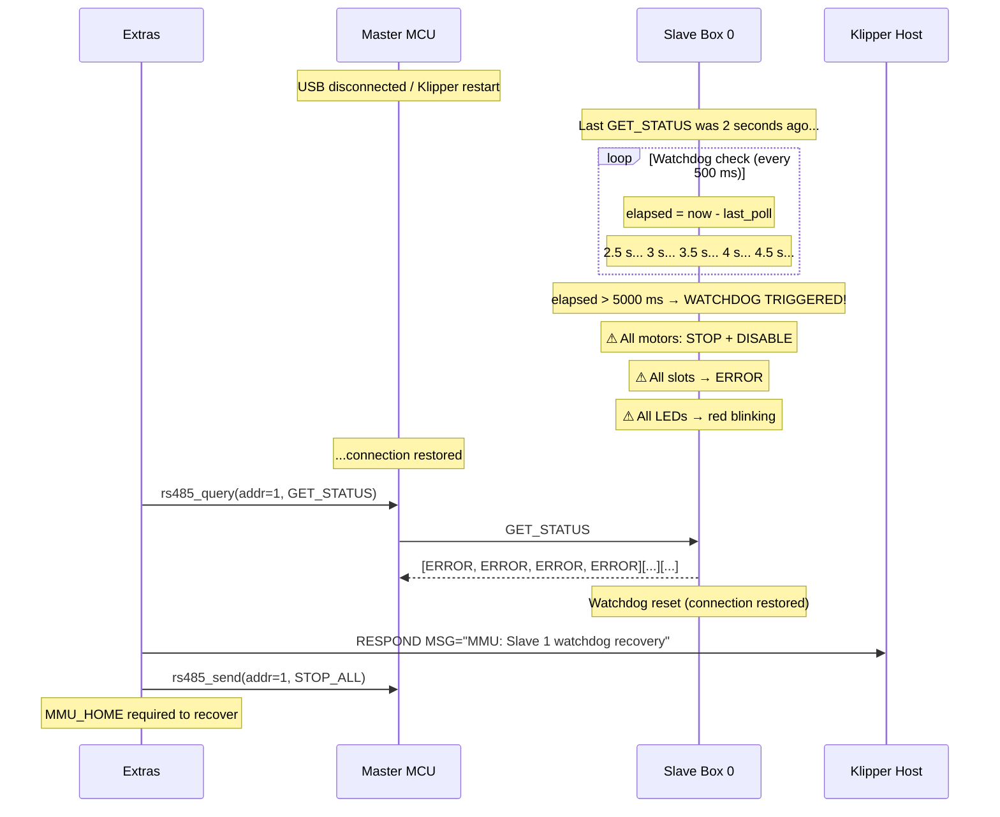

### Scenario 7: Set Filament Color

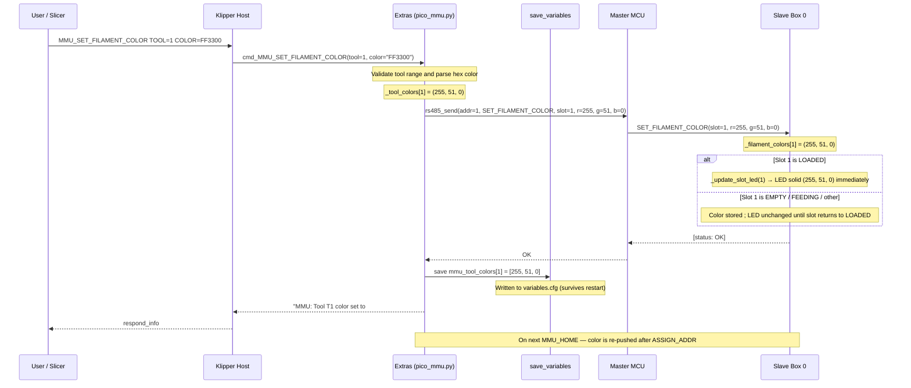

### Scenario 8: Filament Color After Power Cycle

**Context:** A previous session set colors for some slots via `MMU_SET_FILAMENT_COLOR`. The printer was then powered off. On the next boot the user runs `MMU_HOME` — no `MMU_SET_FILAMENT_COLOR` commands are issued in this session.

**Key design fact:** The slave does **not** persist `_filament_colors` to flash. On every boot it resets to the compiled-in default (solid green). The slave also does **not** report colors in `GET_STATUS` — only slot states, sensor bits, and error codes are returned. Klipper (`save_variables` → `variables.cfg`) is the sole persistent store for color assignments; the slave is always a downstream consumer.

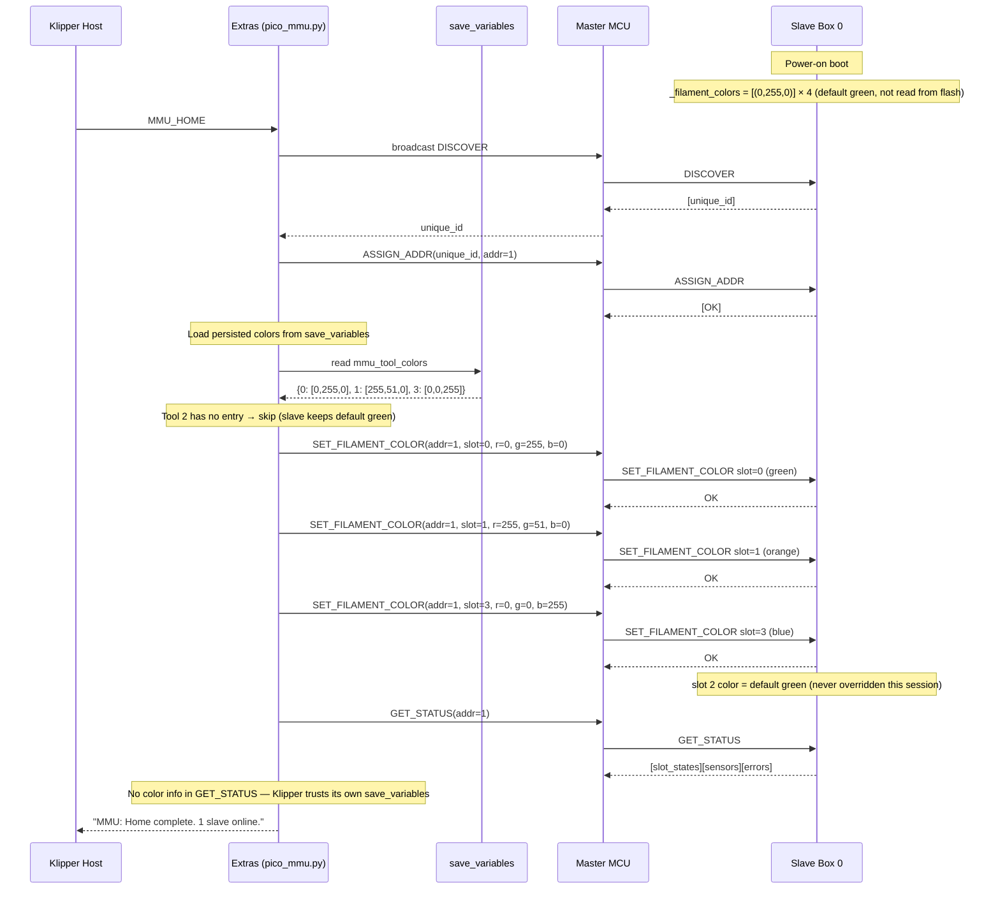

**Summary of responsibilities:**

| Concern | Owner |
|---|---|
| Color persistence across power cycles | Klipper `save_variables` (`variables.cfg`) |
| Color storage during a session | Slave RAM (`_filament_colors[]`) |
| Color reporting to host | Not implemented — slave never pushes colors; host is the source of truth |
| Re-synchronisation on boot | `MMU_HOME` → `ASSIGN_ADDR` phase pushes all saved colors back to the slave |
| Slots with no saved color | Slave default green `(0, 255, 0)` is used; Klipper shows no color entry |

### Scenario 9: Concurrent Slots — ASSIST Active While Another Slot Is Fed

**Context:** Slot 0 is in ASSIST mode (the active tool is printing). The master simultaneously stages the next colour by feeding slot 1. Both motors run independently; each slot's state machine is fully isolated.

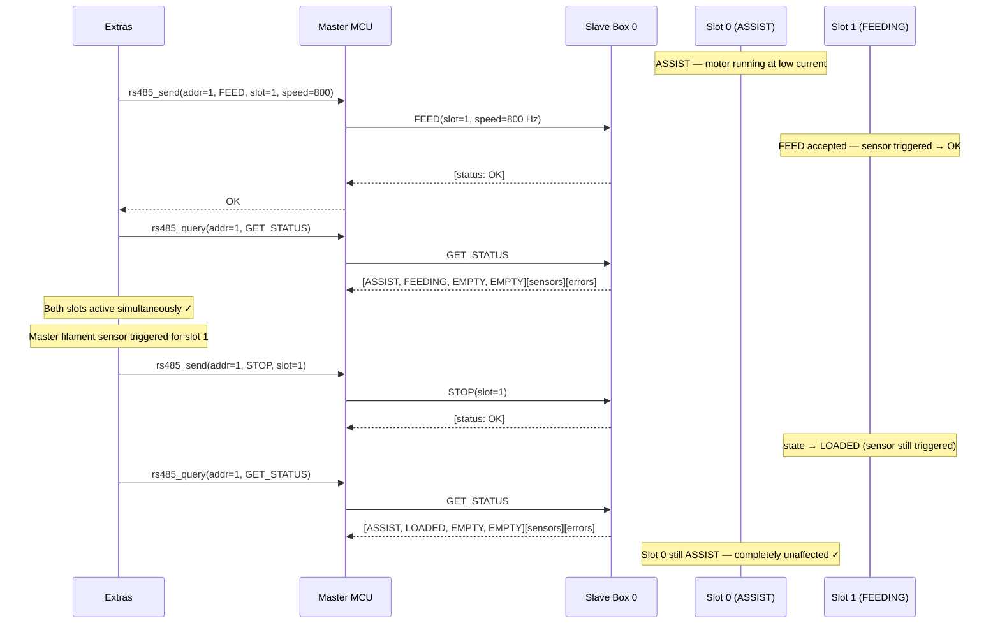

**Key invariant:** Each slot has its own stepper, TMC2209, and state machine instance. Commands to different slots are fully independent; there is no shared lock between them.

### Scenario 10: SET_FILAMENT_COLOR While a Slot Is in ASSIST

**Context:** During active printing (slot in ASSIST), the user updates the filament color for the active slot and/or for an idle slot.

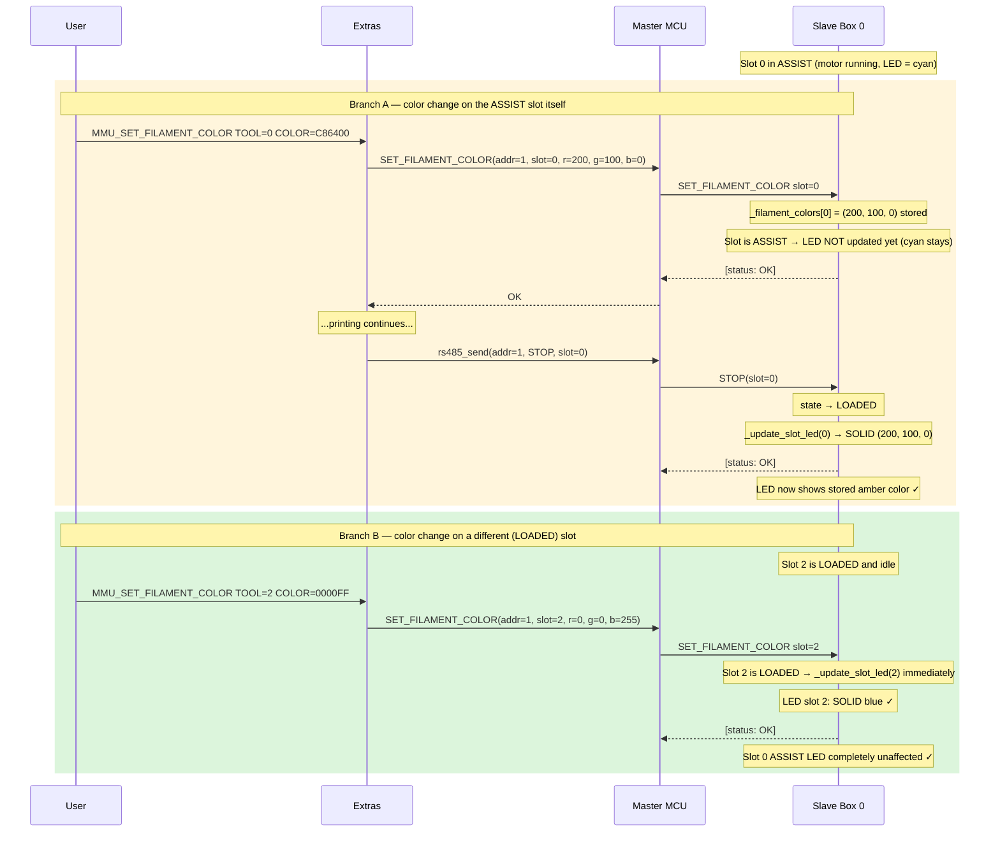

**Key rules:**
- `SET_FILAMENT_COLOR` always stores the color in `_filament_colors[slot]`.
- `_update_slot_led` is only called if `slot.state == LOADED`; all other states (ASSIST, FEEDING, RETRACTING, ERROR, EMPTY) leave the LED unchanged.
- The stored color is automatically applied on the next `LOADED` transition (e.g., after `STOP`).

### Scenario 11: Hot-Plug — Second Slave Joins Active Bus

**Context:** The system is running normally with Slave 1 assigned and being polled at 20 Hz. A second slave box is powered on mid-session and needs to join the bus without interrupting ongoing operations.

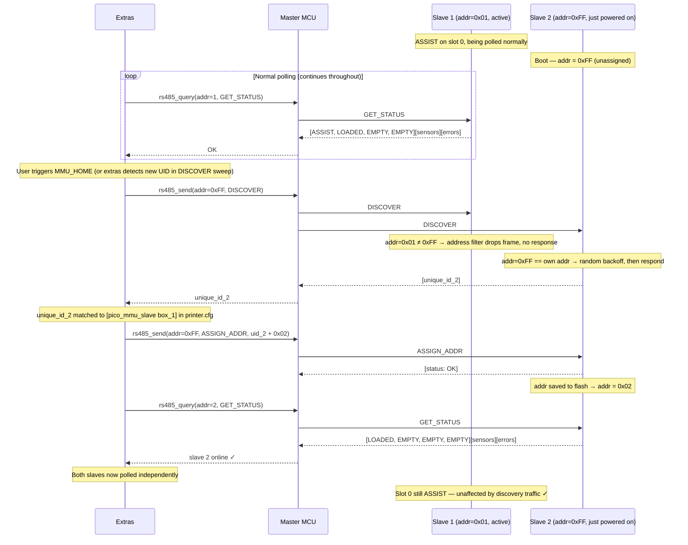

**Key invariant:** An already-assigned slave ignores `DISCOVER` because its address filter rejects `addr=0xFF` frames (it only processes frames addressed to its own address, broadcast `0x00`, or `DISCOVER`/`ASSIGN_ADDR` when `addr == 0xFF`).

### Scenario 12: Short Retracts During Active Print (ASSIST Unaffected)

**Context:** Print is in progress with slot 0 in ASSIST mode. The slicer emits small retraction moves between travel segments (typically 0.5–2 mm) to prevent oozing. These are extruder-only moves — the slave is never notified and stays in ASSIST throughout.

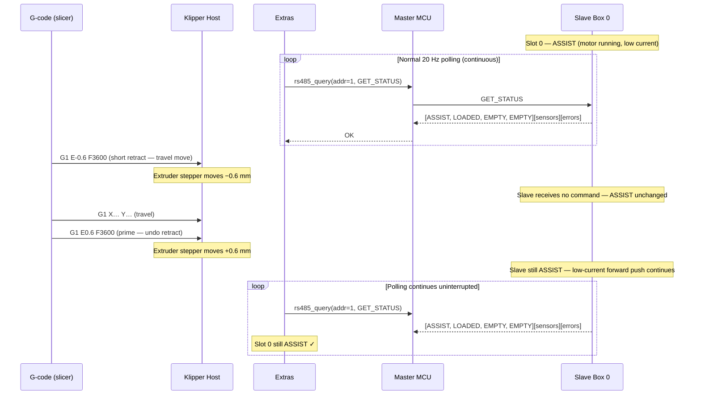

**Key invariant:** Short extruder retracts are purely Klipper extruder moves. The slave motor runs independently at constant low current in ASSIST; there is no RS485 command for a short retract. The slave is not aware of extruder position.

### Scenario 13: RETRACT on an Idle Slot While Another Is in ASSIST

**Context:** Print is in progress (slot 1 in ASSIST). The operator or slicer triggers an unload of slot 2, which is currently LOADED (e.g. staging the next spool change or removing unused filament). Both operations run on the same slave concurrently.

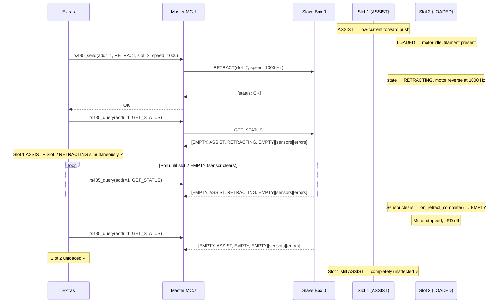

**Key invariant:** `RETRACT` on a LOADED slot is accepted regardless of what other slots are doing. The `retract()` method only checks the state of its own slot (`Slot` instance). If the slot is in ASSIST, `retract()` stops the assist motor first and then starts reverse — but here slot 2 is LOADED (idle), so it proceeds directly to RETRACTING.

### Scenario 14: System Block Diagram

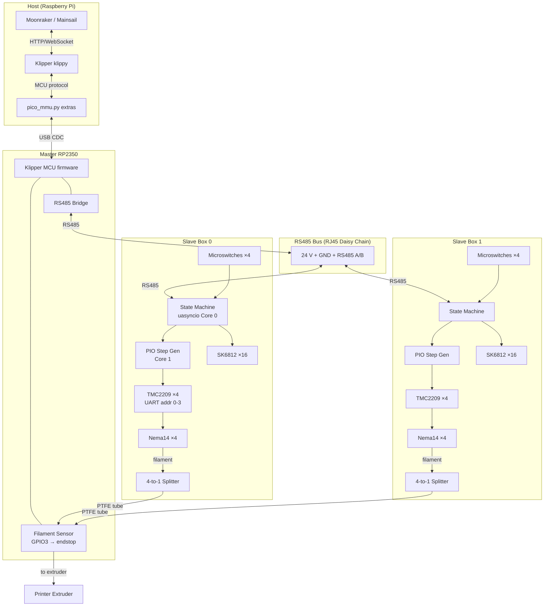

---

## 1. RS485 Protocol (Master ↔ Slave)

### 1.1 Physical / Link Layer

- Half-duplex RS485, **115200 baud, 8N1**
- Topology: **Master Polling** — slaves transmit only in response to a master request
- Response timeout: **10 ms**, retries: up to **3**, then mark slave as OFFLINE

### 1.2 Frame Format

```
┌──────────┬──────┬─────┬─────┬─────┬──────────────┬────────┐
│ PREAMBLE │ ADDR │ CMD │ SEQ │ LEN │     DATA     │ CRC16  │
│  1 byte  │  1   │  1  │  1  │  1  │  0–64 bytes  │ 2 bytes│
└──────────┴──────┴─────┴─────┴─────┴──────────────┴────────┘
```

| Field | Size | Description |
|---|---|---|
| PREAMBLE | 1 | `0xAA` — frame start marker |
| ADDR | 1 | `0x00` = broadcast, `0x01–0xFE` = slave address, `0xFF` = unassigned |
| CMD | 1 | Command code; **bit 7**: `0` = request (Master→Slave), `1` = response (Slave→Master) |
| SEQ | 1 | Sequence number; slave echoes the same SEQ in its response |
| LEN | 1 | Length of the DATA field (0–64) |
| DATA | 0–64 | Payload (command-specific) |
| CRC16 | 2 | CRC-16/MODBUS over all preceding bytes, little-endian |

### 1.3 Command Set

**Direction: Master → Slave (bit 7 = 0)**

| CMD | Name | Request DATA | Response DATA | Description |
|---|---|---|---|---|
| `0x01` | PING | — | `[fw_ver:2]` | Presence check, returns firmware version |
| `0x02` | DISCOVER | — | `[unique_id:8]` | Find unassigned slaves (addr=0xFF) |
| `0x03` | ASSIGN_ADDR | `[unique_id:8][new_addr:1]` | `[status:1]` | Assign address to slave |
| `0x04` | GET_STATUS | — | `[slot_states:4][sensors:1][errors:1]` | State of all 4 slots |
| `0x05` | FEED | `[slot:1][speed_hz:2]` | `[status:1]` | Start feeding from slot |
| `0x06` | RETRACT | `[slot:1][speed_hz:2]` | `[status:1]` | Retract filament in slot |
| `0x07` | SET_ASSIST | `[slot:1][current_ma:2]` | `[status:1]` | Enable Assist Mode |
| `0x08` | STOP | `[slot:1]` | `[status:1]` | Stop one slot motor |
| `0x09` | STOP_ALL | — | `[status:1]` | Emergency stop all motors |
| `0x0A` | SET_LED | `[mode:1][slot:1][r:1][g:1][b:1]` | `[status:1]` | Control WS2812B LEDs |
| `0x0B` | GET_CONFIG | — | `[config_blob:N]` | Read slave configuration |
| `0x0C` | SET_CURRENT | `[slot:1][run_ma:2][hold_ma:2]` | `[status:1]` | Configure TMC2209 current |
| `0x0D` | HOME_SLOT | `[slot:1]` | `[status:1]` | Feed until sensor triggers |
| `0x0E` | SET_FILAMENT_COLOR | `[slot:1][r:1][g:1][b:1]` | `[status:1]` | Set filament color for a slot; updates LED immediately if slot is LOADED |

**Status codes (`status` field in responses):**

| Code | Constant | Description |
|---|---|---|
| `0x00` | OK | Command accepted / completed |
| `0x01` | BUSY | Slot is busy with another operation |
| `0x02` | ERROR_SLOT_EMPTY | No filament in slot |
| `0x03` | ERROR_JAM | Jam detected |
| `0x04` | ERROR_TIMEOUT | Operation timed out |
| `0x05` | ERROR_INVALID_SLOT | Slot number out of range |
| `0xFF` | UNKNOWN_CMD | Unknown command |

**Slot states (`slot_states` field in GET_STATUS, 1 byte × 4 slots):**

| Code | Constant | Description |
|---|---|---|
| `0x00` | EMPTY | No filament (sensor not triggered) |
| `0x01` | LOADED | Filament present, motor idle |
| `0x02` | FEEDING | Active feed |
| `0x03` | RETRACTING | Retract in progress |
| `0x04` | ASSIST | Friction-compensation mode (low current) |
| `0x05` | ERROR | Error (jam / timeout) |

### 1.4 Auto-Enumeration Protocol

Executed on every system start (`MMU_HOME`):

```
1. Master: broadcast DISCOVER (addr=0xFF)
2. Unassigned slaves (addr=0xFF): respond after random backoff 0–50 ms,
   payload = unique_id (8 bytes, RP2350 ROM ID)
3. Master: records unique_id
   - Collision (CRC fail or two simultaneous responses) → retry DISCOVER for this cycle
4. Master: ASSIGN_ADDR(unique_id, new_addr) for each discovered slave
5. Slave: saves address to flash (rp2350 flash NVS), responds OK
6. Repeat steps 1–5 until 3 consecutive DISCOVER cycles return empty
```

### 1.5 Polling Cycle (normal operation)

```python
# pseudocode, ~20 Hz
while True:
    for addr in assigned_slaves:
        resp = send_recv(GET_STATUS, addr, timeout_ms=10)
        if resp is None:
            slaves[addr].offline_count += 1
            if slaves[addr].offline_count > 3:
                raise_alarm(f"Slave {addr} OFFLINE")
        else:
            slaves[addr].update(resp)
            slaves[addr].offline_count = 0
    await asyncio.sleep_ms(50)
```

---

## 2. Slave Firmware (MicroPython, RP2350)

### 2.1 File Structure

```
slave/
├── main.py                  # Entry point: starts Core 0 (asyncio) and Core 1 (_thread)
├── config.py                # Pins, default address, currents, timeouts
├── bus/
│   ├── protocol.py          # Frame encode/decode, CRC16
│   └── rs485.py             # UART + DE/RE pin management
├── motor/
│   ├── tmc2209.py           # TMC2209 UART driver: registers, current, StallGuard
│   ├── stepper.py           # PIO-based step generator (frequency, direction)
│   └── slot.py              # Per-slot state machine
├── peripheral/
│   ├── sensor.py            # Microswitches: debounce, IRQ
│   └── led.py               # WS2812B via PIO
└── state_machine.py         # Coordinator for 4-slot state machines
```

### 2.2 Core Assignment

| Core | Tasks |
|---|---|
| **Core 0** | `uasyncio` event loop: RS485 receive/parse, slot state machines, sensor IRQ, watchdog timer |
| **Core 1** | `_thread`: PIO step programs (4 SMs), TMC2209 UART configuration, WS2812B timing |

**RP2350 PIO resources:** 2 blocks × 4 SMs = 8 SMs total.  
Allocation: 4 SMs for step generation (one per slot), 1 SM for WS2812B, 3 SMs reserved.

### 2.3 Slot State Machine

```
         [sensor triggered]
EMPTY ──────────────────────→ LOADED
                                │
              [FEED cmd]        │  [RETRACT cmd]
FEEDING ←────────────────────── │ ────────────────────→ RETRACTING
   │       [master sensor OK]   │   [sensor cleared]          │
   └──────→ LOADED ←────────────┘                             ↓ EMPTY
   │                            │
   │ [timeout/jam]              │ [SET_ASSIST]
   ↓                            ↓
ERROR ←──────────────────── ASSIST ──[STOP]──→ LOADED
   │
   └──[STOP]──→ LOADED/EMPTY (depending on sensor)

STOP_ALL → stops motor; new state = LOADED or EMPTY based on sensor
```

### 2.4 Watchdog (safety)

If the Master has not polled the slave (`GET_STATUS` not received) for more than **5 seconds**, the slave automatically:
1. Stops all motors
2. Extinguishes active LED animations
3. Moves all slots to `ERROR`

Implemented as a `uasyncio.create_task` that checks `last_poll_time`.

### 2.5 StallGuard (jam detection)

TMC2209 is read via UART every 200 ms (while FEED or RETRACT is active):
- If `SG_RESULT < SG_THRESHOLD` → slot transitions to `ERROR(JAM)`
- `SG_THRESHOLD` is set in `config.py`, default `20`

---

## 3. Master MCU Firmware (C, Klipper MCU)

### 3.1 Overview

Patch to `klipper/src/` for RP2350. Built with the standard Klipper `make` + `menuconfig` (target: RP2350, USB CDC). Adds the `pico_mmu/` module.

### 3.2 File Structure (additions to klipper/src)

```
klipper/src/pico_mmu/
├── rs485.c              # UART init, TX/RX buffers, DE/RE management
├── rs485.h
├── protocol.c           # CRC-16/MODBUS, frame encode/decode
├── protocol.h
└── command_bridge.c     # Klipper MCU command registration
```

### 3.3 Klipper MCU Commands (registered in command_bridge.c)

| Command | Parameters | Description |
|---|---|---|
| `config_rs485` | `bus`, `tx_pin`, `rx_pin`, `de_pin`, `baud` | Initialise RS485 interface |
| `rs485_send` | `addr`, `cmd`, `seq`, `data` | Send frame to slave |
| `rs485_query` | `addr`, `cmd`, `seq`, `data`, `timeout` | Send and wait for response |

Slave responses are forwarded to the host via the standard Klipper response callback.

### 3.4 Master RP2350 Pin Assignment

| Pin | Purpose |
|---|---|
| USB-C | Klipper host (USB CDC) |
| UART1 TX / RX | RS485 transceiver (MAX485 / SP485) |
| GPIO (DE) | RS485 direction enable |
| GPIO (SENSOR) | Final splitter microswitch (endstop) |

The sensor is registered as a standard Klipper endstop — accessible via `[filament_switch_sensor]` in `printer.cfg`.

---

## 4. Klipper Extras Module (Python, host)

### 4.1 File

```
klipper/klippy/extras/pico_mmu.py
```

### 4.2 G-code Commands

| Command | Parameters | Description |
|---|---|---|
| `MMU_HOME` | — | Auto-enumeration, initialise all slaves |
| `MMU_STATUS` | — | Print state of all slots |
| `MMU_CHANGE_TOOL` | `TOOL=N` | Full filament change cycle |
| `MMU_LOAD` | `TOOL=N` | Load without changing (if slot already selected) |
| `MMU_UNLOAD` | — | Retract current filament |
| `MMU_SELECT` | `TOOL=N` | Select slot without loading |
| `MMU_SET_FILAMENT_COLOR` | `TOOL=N COLOR=RRGGBB` | Set filament color for a tool slot; pushes `SET_FILAMENT_COLOR` to the slave and persists via `[save_variables]`; colors are re-pushed to slaves on every `MMU_HOME` |

`T0`, `T1`, … `TN` — standard Klipper tool-change commands, forwarded to `MMU_CHANGE_TOOL`.

### 4.3 Top-Level State Machine (extras)

```
IDLE
 │ [T0..TN / MMU_CHANGE_TOOL]
 ↓
UNLOADING ──[tip forming + RETRACT slave]──→ TIP_FORMING
 │
 ↓
SELECTING ──[FEED target slave]──→ LOADING
 │
 ↓ [master sensor triggered]
ASSIST_ACTIVE ──[RESUME extruder]──→ PRINTING
 │
 ↓ [runout / new T cmd]
UNLOADING (cycle repeats)

ERROR ←── any step on timeout/jam → PAUSE print + notify
```

### 4.4 Tool Change Sequence (full cycle)

```
1.  Klipper: MMU_CHANGE_TOOL TOOL=N
2.  extras: save current position, PAUSE extruder feed
3.  extras: execute tip-forming sequence (retract + wipe via Klipper extruder)
4.  extras → Master: rs485_send(current_slave, RETRACT, current_slot, speed)
5.  extras: poll GET_STATUS until slot_state[current_slot] == EMPTY (or timeout 30 s → ERROR)
6.  extras → Master: rs485_send(target_slave, FEED, target_slot, speed)
7.  extras: wait for master filament sensor triggered (endstop event, timeout 60 s → ERROR)
8.  extras → Master: rs485_send(target_slave, SET_ASSIST, target_slot, current_ma=150)
9.  extras: RESUME extruder feed
10. On error at any step: PAUSE print + RESPOND MSG with error description
```

### 4.5 Runout Detection

Two runout sources:
1. **Active** — Klipper G-code `T0..TN` (slicer-driven change)
2. **Passive** — slave detects empty slot (`EMPTY`) on the next `GET_STATUS` → extras automatically calls `MMU_CHANGE_TOOL` for the next available slot, or `PAUSE` if none are available

### 4.6 Configuration (printer.cfg)

```ini
[pico_mmu]
serial: /dev/serial/by-id/usb-Klipper_rp2350_XXXXX
rs485_baud: 115200
tool_count: 8
polling_interval: 50   # ms, ~20 Hz

[pico_mmu_slave box_0]
unique_id: 0x0123456789ABCDEF
slots: 0,1,2,3

[pico_mmu_slave box_1]
unique_id: 0xFEDCBA9876543210
slots: 4,5,6,7

# Standard T-commands
[gcode_macro T0]
gcode: MMU_CHANGE_TOOL TOOL=0

[gcode_macro T1]
gcode: MMU_CHANGE_TOOL TOOL=1
# ... and so on
```

---

## 5. Auto-Enumeration & Addressing

### 5.1 Startup Sequence

```
1. Master MCU boot → initialise RS485 (config_rs485)
2. Klipper connects → extras module loads
3. extras: call MMU_HOME (automatically or on command)
4. extras → Master: broadcast DISCOVER (addr=0xFF, several cycles)
5. Master: receives responses with unique_id, forwards to host via rs485_response
6. extras: matches unique_id with [pico_mmu_slave] in printer.cfg → gets target address
7. extras → Master: ASSIGN_ADDR(unique_id, assigned_addr) for each found slave
8. extras: GET_STATUS for each assigned slave → builds slot map
9. extras: logs result to Klipper console
```

### 5.2 Address Storage on Slave

- Address stored in flash (last 4 KB sector, via `rp2_flash` MicroPython API)
- On first boot (flash empty) — address = `0xFF` (unassigned)
- After `ASSIGN_ADDR` — address is saved and survives power cycles

---

## 6. Verification

| Test | Type | Pass Criteria |
|---|---|---|
| Frame encode/decode + CRC16 | Unit (Python) | All test vectors match on both ends |
| Slave state machine | Unit (mock hardware) | All EMPTY→LOADED→…→ERROR→LOADED transitions correct |
| RS485 loopback | Hardware (2× Pico 2) | All commands (0x01–0x0D) received without errors, latency < 10 ms |
| Auto-enumeration | Hardware (3 slaves) | All slaves discovered and assigned an address in 1 MMU_HOME cycle |
| Full tool change T0→T1 | Integration (Klipper) | Change completes in < 10 s, no errors, assist mode active |
| Concurrent slots (ASSIST + FEED) | Integration (in-process) | Both slot states coexist in GET_STATUS; STOP on one slot does not affect the other |
| Concurrent slots (ASSIST + RETRACT on idle slot) | Integration (in-process) | RETRACT completes on idle slot; ASSIST slot state unchanged throughout |
| Short retracts during ASSIST | Design invariant | No RS485 command sent to slave for extruder-only retracts; GET_STATUS shows ASSIST throughout |
| SET_FILAMENT_COLOR during ASSIST | Integration (in-process) | Color stored but LED unchanged; applied on STOP → LOADED |
| SET_FILAMENT_COLOR on idle slot during ASSIST | Integration (in-process) | Idle slot LED updated immediately; ASSIST slot LED unaffected |
| Hot-plug (slave joins active bus) | Integration (in-process) | Assigned slave ignores DISCOVER; new slave is enumerated and polled without disrupting the first |
| Stress polling | Hardware (8 slaves, 1 hour) | Packet loss < 0.1%, no hangs |

---

## 7. Design Decisions

| Decision | Rationale |
|---|---|
| Master in C (Klipper MCU firmware) | Native Klipper integration, standard filament sensor, no latency overhead |
| Slave in MicroPython | Fast iteration, PIO for real-time tasks, adequate performance |
| Auto-enumeration via RP2350 unique_id | No DIP switches, address persisted in flash |
| 20 Hz polling | Balance between responsiveness (50 ms) and bus load |
| Tip forming on the Klipper side | Full extruder control, reuse of existing logic |
| StallGuard for jam detection | No additional sensors, built-in TMC2209 capability |
| 5 s watchdog on slave | Safe stop on connection loss |

---

## 8. Out of Scope (Future Phases)

- OTA firmware updates to slaves over RS485
- Web UI / Mainsail integration
- Moonraker plugin
- Nema 17 support with different currents (config already accommodates this)
- Colour-coded spool presets (LED preset by filament type)
